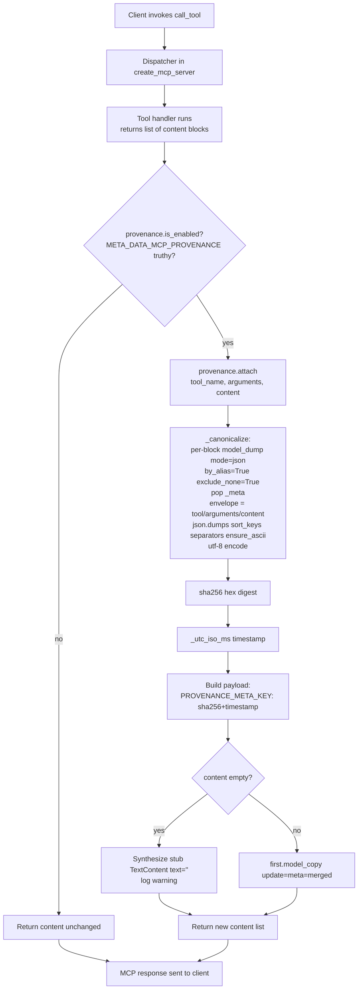
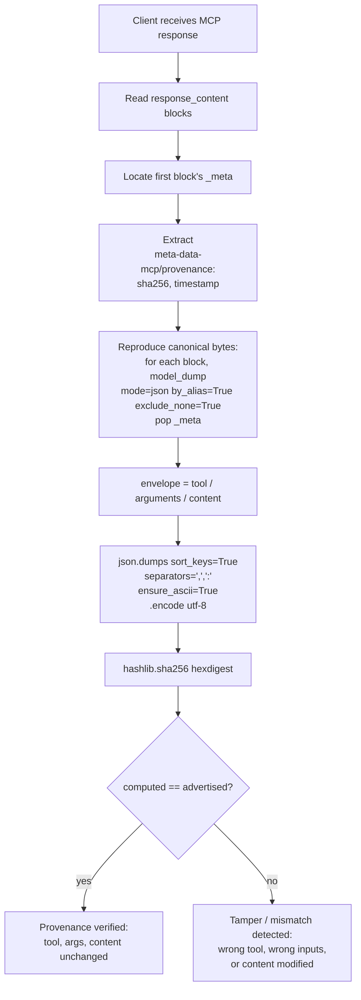

# C4-Code: Provenance

## Overview

- **Name**: Provenance
- **Description**: Optional sha256 + ISO-8601 millisecond UTC timestamp attached to every `call_tool` response, bound to the tool name, arguments, and content blocks. Provides tamper-evidence and an audit trail for clients that opt in.
- **Location**: `/Users/lderek/GitHub/meta-data-mcp/meta_data_mcp/provenance.py`
- **Language**: Python 3 (typed, `from __future__ import annotations`)
- **Purpose**: Bind the identity of a call (tool + arguments) to its output (content blocks) with a reproducible cryptographic digest. Off by default — zero per-call cost for callers that don't need it; opt-in via the `META_DATA_MCP_PROVENANCE` env var so the flip happens uniformly at the dispatcher in `meta_data_mcp.server.create_mcp_server` without per-handler wiring.

---

## Code Elements

| Symbol | Signature | Description | Lines |
|---|---|---|---|
| `PROVENANCE_META_KEY` | `str = "meta-data-mcp/provenance"` | The key inserted into the first content block's `_meta` dict. Public constant; clients use it to locate the provenance payload. | 86 |
| `_ENV_VAR` | `str = "META_DATA_MCP_PROVENANCE"` | Name of the environment variable the dispatcher consults at startup. | 88 |
| `_TRUTHY` | `frozenset({"1", "true", "yes", "on"})` | Case-insensitive accepted values; anything else (including empty / unset) is falsy. | 89 |
| `Content` | `types.TextContent \| types.ImageContent \| types.EmbeddedResource` | Type alias for the three MCP content block kinds the wrapper supports. | 93 |
| `is_enabled()` | `is_enabled() -> bool` | True iff `META_DATA_MCP_PROVENANCE` is set to a truthy value. `os.getenv(_ENV_VAR, "").strip().lower() in _TRUTHY` — surrounding whitespace ignored, case-insensitive. | 96–98 |
| `_canonicalize` | `_canonicalize(tool_name: str, arguments: dict[str, Any] \| None, content: Sequence[Content]) -> bytes` | Produces the canonical byte form of the `(tool, arguments, content)` envelope. The exact recipe — every kwarg is load-bearing and forms the public verification contract. | 101–134 |
| `_utc_iso_ms()` | `_utc_iso_ms() -> str` | ISO 8601 UTC timestamp with millisecond precision and trailing `Z` (e.g. `2026-05-17T14:23:08.041Z`). | 137–140 |
| `attach` | `attach(content: Sequence[Content], *, tool_name: str, arguments: dict[str, Any] \| None) -> list[Content]` | The wrap helper. Returns a fresh content list with `{sha256, timestamp}` merged into the first block's `_meta` under `PROVENANCE_META_KEY`. Synthesizes a stub `TextContent(text="")` when input content is empty and emits a warning log. Inputs are not mutated; first block is rebuilt via `model_copy(update=...)`. | 143–186 |
| `__all__` | list | Public exports: `PROVENANCE_META_KEY`, `attach`, `is_enabled`. | 189 |

---

## Environment Variable: `META_DATA_MCP_PROVENANCE`

- **Name**: `META_DATA_MCP_PROVENANCE` (module-level constant `_ENV_VAR`).
- **Default**: unset → falsy → provenance OFF, zero per-call overhead.
- **Truthy values** (case-insensitive, surrounding whitespace stripped): `1`, `true`, `yes`, `on`.
- **Falsy values**: anything else, including `0`, `false`, `off`, empty string, and unset.
- **Parsing logic** (line 98): `os.getenv(_ENV_VAR, "").strip().lower() in _TRUTHY`.
- **Evaluation site**: read once per dispatch in `meta_data_mcp.server.create_mcp_server`; the dispatcher conditionally calls `attach` on the result of every tool handler, so the flip applies uniformly to meta tools, plugin tools, and any future tools without per-handler wiring.

---

## The Canonical-Bytes Recipe (`_canonicalize`)

Every kwarg is part of the public verification contract. Change any of them and the digest will not match what a receiver computes following the documented recipe.

**Per-block dump:**
```python
block.model_dump(mode="json", by_alias=True, exclude_none=True)
```
- `mode="json"` — coerces nested `AnyUrl` / `Decimal` / `datetime` fields into JSON-native types. Without it, `EmbeddedResource`'s nested `uri: AnyUrl` blows up the serializer.
- `by_alias=True` — uses field aliases (the wire-format names), matching the SDK's outgoing JSON.
- `exclude_none=True` — drops optional fields the SDK leaves unset; the sender side does too, so the receiver must too, or the canonical bytes diverge.
- `_meta` is then popped from each block — the advertised digest must be reproducible by a receiver who only sees the response and the documented contract, not the provenance metadata itself.

**Envelope wrap:**
```python
envelope = {"tool": tool_name, "arguments": arguments or {}, "content": rendered}
```
- `arguments or {}` — `None` is normalized to `{}` so a no-args call and an explicit empty-args call hash identically.

**Top-level JSON dump:**
```python
json.dumps(envelope, sort_keys=True, separators=(",", ":"), ensure_ascii=True).encode("utf-8")
```
- `sort_keys=True` — collapses insertion-order variability across Python runs / dict types.
- `separators=(",", ":")` — compact form, eliminates whitespace variability.
- `ensure_ascii=True` — pins unicode-escape behavior so a receiver using a JSON library with different defaults still produces matching bytes.
- `.encode("utf-8")` — sha256 hashes bytes, not strings.

The digest is the lowercase hex sha256 of these bytes.

**Why tool name and arguments are in the envelope:** including them is what makes the digest useful for audit. A receiver can detect not just content tampering but also "wrong tool" / "wrong inputs" mismatches between what they asked for and what they got back. Without that binding, two different calls returning the same payload would share a fingerprint.

---

## Dependencies

### Internal
- `mcp.types` — `TextContent`, `ImageContent`, `EmbeddedResource` (the three content block kinds the wrapper accepts).
- Consumed by `meta_data_mcp.server.create_mcp_server` (the dispatcher that calls `attach` after `is_enabled()` returns True).

### External
- `hashlib` (stdlib) — sha256.
- `json` (stdlib) — canonical dumps.
- `logging` (stdlib) — empty-content warning.
- `os` (stdlib) — env var lookup.
- `datetime` (stdlib) — UTC timestamp.
- `typing` (stdlib) — `Any`, `Sequence`.
- `mcp` package — the MCP Python SDK content-block models (Pydantic).

---

## Relationships

### Dispatcher flow: `call_tool` → `provenance.attach` → MCP response



### Receiver verification path



---

## Notes

- **Default OFF**: callers that need tamper-evidence or an audit trail opt in via the env var; everyone else pays zero per-call overhead.
- **Uniform application**: the flip lives at the dispatcher (`meta_data_mcp.server.create_mcp_server`), so provenance applies to every tool — meta tools, plugin tools, and future tools — without per-handler wiring.
- **`tool_name` and `arguments` are keyword-only** (`*`-separated) — callers cannot accidentally compute an output-only digest that loses input-output binding.
- **Empty content is anomalous**: a handler returning no content blocks is almost certainly buggy; `attach` synthesizes a stub `TextContent(text="")` so the fingerprint still has somewhere to live, and emits a warning log to surface the anomaly to operators.
- **Immutability**: the input `content` sequence is not mutated. The first block is rebuilt via `model_copy(update={"meta": merged_meta})`, preserving any pre-existing `_meta` keys on that block.
- **Timestamp format**: `YYYY-MM-DDTHH:MM:SS.mmmZ` (millisecond precision, UTC, trailing `Z`). Note the timestamp is **not** part of the hashed envelope — only `tool`, `arguments`, `content` are hashed; the timestamp is sibling metadata.
