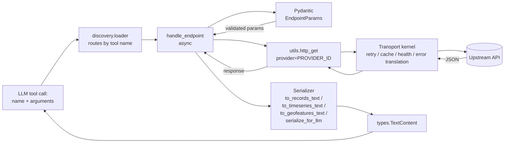

# C4-Code: Provider Plugins

## Overview

- **Name**: Provider Plugins
- **Description**: 75 lazy-activated data-source adapters, one per upstream open-data API, all conforming to a single registration + handler contract. Together they expose **~355 MCP tools** to the host.
- **Location**: `meta_data_mcp/providers/*.py` (excluding `meta_data_mcp.py`, which is the meta server, and `__template__.py`, which is the scaffold)
- **Language**: Python 3.12+
- **Purpose**: Adapt each upstream API into the MCP tool catalog; expose 1-N tools per provider. Each plugin is a thin translator between an upstream HTTP API and the MCP `TextContent` protocol — no business logic, no shared state, no startup cost.

## The Plugin Contract (from `__template__.py`)

Every plugin module is a **declarative bundle** with a fixed module-level surface. The discovery loader (`meta_data_mcp/discovery/loader.py`) introspects this surface via `getattr` and merges it into the live server when the provider is activated.

### Required module-level surface

| Symbol | Type | Purpose |
|---|---|---|
| `PROVIDER_ID` | `str` | Canonical id; MUST match the `server_name` field of the matching `ProviderEntry` in `registry.py` (e.g. `"global-world-bank"`). Passed as `provider=` to every `http_get` call so the kernel can route retries, caching, and health telemetry per-provider. |
| `BASE_URL` | `str` | Upstream API root. Kept as a module constant so tests can monkey-patch it. |
| `TOOLS` | `list[mcp.types.Tool]` | One entry per exposed tool. Each `Tool` has `name`, `description`, `inputSchema` (Pydantic `model_json_schema()`), and optionally `_meta={"ui": {"resourceUri": ...}}` for MCP Apps UI binding. |
| `TOOLS_HANDLERS` | `dict[str, Callable]` | Maps tool name → async handler. The loader skips any `Tool` whose name is missing from this dict (with a `log.warning`). |

### Optional module-level surface

| Symbol | Type | Purpose |
|---|---|---|
| `RESOURCES` | `list[Any]` | MCP resources the provider exposes. Always present (often empty) to keep the merge call uniform. |
| `RESOURCES_HANDLERS` | `dict[str, Any]` | Resource handlers. Mirrors `TOOLS_HANDLERS` for the resources channel. Used by providers that register `ui://` resources via `utils.register_ui_resource`. |
| `main(transport, port, host)` | async function | Allows the plugin to run as a standalone MCP server via `python -m meta_data_mcp.providers.<name>`. Calls `create_mcp_server` + `run_server` from `utils`. Not used by the meta server. |

> There is **no** `UI_RESOURCE_BY_TOOL` constant. UI bindings are attached per-tool via the `_meta={"ui": {"resourceUri": ...}}` keyword on `types.Tool` itself (note: it is `_meta`, not `meta`; see `__template__.py` line 142 for the regression note).

### The canonical handler shape

Every tool handler is an async function with this exact signature and lifecycle:

```python
async def handle_<endpoint>(
    arguments: dict[str, Any] | None = None,
) -> Sequence[types.TextContent]:
    # 1. Validate arguments via Pydantic
    params = EndpointParams(**(arguments or {}))
    # 2. Fetch via the kernel HTTP wrapper (NEVER httpx directly)
    response = http_get(url, params=..., provider=PROVIDER_ID)
    # 3. Translate via a size-bounded serializer
    text = serialize_for_llm(response.json())          # generic JSON
    # or to_records_text(payload) / to_timeseries_text(...) / to_geofeatures_text(...) / to_json_text(...)
    # 4. Wrap and return
    return [types.TextContent(type="text", text=text)]
```

Four hard rules enforced by convention and the `_template__.py` kernel-contract docstring:

1. **Always pass `provider=PROVIDER_ID`** to `http_get` / `http_post`. This single kwarg unlocks retry-on-429/5xx, partitioned response caching, health-registry feedback, and URL-redacted `ProviderError` translation. Direct `httpx.get` is a regression — every kernel guarantee opts out with it.
2. **Always return `list[types.TextContent]`**, even for single results. Multi-modal returns (`ImageContent`, `EmbeddedResource`) are typed in the return annotation but rarely used.
3. **Always serialize via a size-bounded serializer**, not `json.dumps` directly. The serializers truncate large responses so they fit the LLM context window.
4. **Validate inputs with Pydantic, surface `ValidationError` raw.** Callers branch on `ValidationError` vs. `ProviderError`, so handlers re-raise it rather than catching-and-wrapping.

## Provider Categorization

The 75 plugins span 30 controlled-vocabulary domains (defined in `registry.py:DOMAINS`). The counts below are domain memberships, so providers spanning multiple domains (e.g. `global_faostat` is `agriculture` + `statistics` + `environment`) are counted in each. Sorted by population:

| Category | Count | Representative providers |
|---|---|---|
| Government / open-data portals | 18 | `us_data_gov`, `uk_gov`, `fr_data_gouv`, `au_data_gov`, `ca_open_gov`, `sg_data_gov`, `nl_tweedekamer` |
| Official statistics | 10 | `eu_eurostat`, `uk_ons`, `nl_cbs`, `global_oecd`, `global_imf`, `global_world_bank` |
| Health / biomedical | 8 | `us_fda_openfda`, `us_cdc_socrata`, `us_clinicaltrials`, `global_who_gho`, `global_disease_sh`, `global_europepmc` |
| Scholarly / research | 6 | `global_arxiv`, `global_crossref`, `global_openalex`, `global_open_library`, `global_europepmc`, `cern_opendata` |
| Finance / economics | 6+6 | `eu_ecb`, `us_sec_edgar`, `us_treasury_fiscal`, `global_frankfurter`, `global_dbnomics`, `global_coingecko` |
| Earth-science / environment / weather | 6+5+4 | `eu_copernicus`, `us_noaa_ncei`, `us_noaa_awc`, `us_noaa_tides`, `us_usgs_earthquake`, `global_open_meteo`, `global_openaq` |
| Security / vulnerability | 5 | `global_nvd_cve`, `us_cisa_kev`, `global_osv_dev`, `global_epss`, `global_opensanctions` |
| Geo / geocoding / culture | 5+2+3 | `global_overpass`, `global_osm_nominatim`, `us_census_geocoder`, `us_arcgis_item`, `global_unesco_heritage`, `global_met_museum` |
| Legal | 4 | `uk_legislation`, `us_courtlistener`, `us_federal_register`, `nl_rechtspraak` |
| Knowledge / encyclopedic | 4 | `global_wikidata`, `global_wikipedia`, `global_gdelt`, `global_open_library` |
| Transit / aviation / space | 3+3+1 | `ch_sbb`, `de_db`, `nl_ndov`, `us_faa_nasstatus`, `global_opensky`, `us_nasa` |
| Biology / biodiversity / chemistry | 2+2+1 | `global_gbif`, `global_inaturalist`, `global_pubchem`, `global_rcsb_pdb` |
| Networking | 2 | `global_bgpview`, `global_ripe_stat` |
| Specialty city portals (Socrata/ArcGIS) | — | `us_raleigh`, `us_cary`, `us_fayetteville`, `us_nc_onemap`, `us_ncdeq_gis` |
| Trade / agriculture / news / crypto / etc. | 1 each | `global_un_comtrade`, `global_faostat`, `global_gdelt`, `global_coingecko` |

### Quick-reference: 12 representative providers

| Provider ID | One-line description | Response shape |
|---|---|---|
| `global-world-bank` | Country/indicator catalogues + time-series for development indicators | **timeseries** (`shape/timeseries/v1`) |
| `us-data-gov` | CKAN-shape federal catalog: dataset discovery + full metadata | **records** (`shape/records/v1`) |
| `global-overpass` | OpenStreetMap query API (raw OverpassQL + amenity/bbox helpers) | **geofeatures** (`shape/geofeatures/v1`) |
| `global-nvd-cve` | NIST CVE 2.0 search + record fetch + change history | **custom** (vulnerability app UI) |
| `eu-eurostat` | EU statistics via SDMX | **timeseries** |
| `eu-ecb` | European Central Bank exchange rates / monetary stats | **timeseries** |
| `global-frankfurter` | FX rates wrapper around ECB | **timeseries** |
| `us-sec-edgar` | SEC filings + company concept facts | **records** |
| `global-arxiv` | Pre-print metadata search | **records** |
| `global-osm-nominatim` | Forward / reverse geocoding | **geofeatures** |
| `us-fda-openfda` | FDA drugs / devices / adverse-events | **records** |
| `us-cisa-kev` | Known Exploited Vulnerabilities catalog | **custom** (vulnerability app UI) |

Of the 75 plugins, **71 import a `ui_resources.shape_*` URI** (i.e. bind tool output to a host-rendered UI shape), and **36 use a typed `to_*_text()` serializer** (`to_records_text`, `to_timeseries_text`, `to_geofeatures_text`). The remainder use the generic `serialize_for_llm` JSON formatter.

## Representative Implementations

### 1. Records-shape — `us_data_gov.py`

- **File**: `meta_data_mcp/providers/us_data_gov.py`
- **PROVIDER_ID**: `us-data-gov`
- **Tools (2)**: `us-datagov-list-datasets`, `us-datagov-get-dataset`
- **Response shape**: `records` — adapts CKAN `/search` JSON to `{rows, schema, default_facets, after, count}` so the host renders a faceted table.
- **Notable**:
  - Imports `RECORDS_URI` from `ui_resources.shape_records_v1` and binds it via `_meta={"ui": {"resourceUri": RECORDS_URI}}` on the list tool.
  - `_datagov_search_to_shape_payload` truncates descriptions at `_MAX_DESC_CHARS = 500` to stay within payload budgets.
  - Surfaces upstream pagination cursors (`after`) verbatim so chained calls work.
  - Lets Pydantic `ValidationError` propagate raw (pre-kernel-translation) so callers can branch on it.

### 2. Timeseries-shape — `global_world_bank.py`

- **File**: `meta_data_mcp/providers/global_world_bank.py`
- **PROVIDER_ID**: `global-world-bank`
- **Tools (8)**: `world-bank-list-countries`, `world-bank-get-country`, `world-bank-list-indicators`, `world-bank-search-indicators`, `world-bank-get-indicator-data`, `world-bank-list-topics`, `world-bank-list-sources`, `world-bank-list-income-levels`
- **Response shape**: World Bank returns `[metadata, rows]`; the indicator-data tool adapts this to `shape/timeseries/v1` (`{points: [{date, value, series}], axes: {x, y}}`) and binds it via `TIMESERIES_URI`.
- **Notable**:
  - `_world_bank_indicator_data_to_shape_payload` collapses multi-country responses into per-country series (so the chart renders as separate lines), filters non-numeric values, and uses the indicator name as the y-axis label.
  - Only the data tool gets the UI binding; catalogue tools return generic `serialize_for_llm` JSON.
  - Catalogue endpoints (`countries`, `topics`, `sources`, `incomeLevel`) follow the same skeleton — pure Pydantic-to-querystring shims.

### 3. Geofeatures-shape — `global_overpass.py`

- **File**: `meta_data_mcp/providers/global_overpass.py`
- **PROVIDER_ID**: `global-overpass`
- **Tools (4)**: `overpass-query`, `overpass-status`, `overpass-around-amenity`, `overpass-bbox-feature`
- **Response shape**: `geofeatures` — adapts OSM `node`/`way`/`relation` arrays to GeoJSON-flavoured feature collections.
- **Notable**:
  - `_run_overpass_query` is a shared private helper that sniffs the response content-type and falls back to text when the upstream returns non-JSON (e.g. for `/status`).
  - Helpers (`around_amenity`, `bbox_feature`) synthesise OverpassQL strings so callers don't need to know the query language.
  - Imports `NonEmptyStr` from `meta_data_mcp.fields` for safer string params.
  - Module docstring documents fair-use rate-limit etiquette for the shared public endpoint.

### 4. Custom-shape — `global_nvd_cve.py`

- **File**: `meta_data_mcp/providers/global_nvd_cve.py`
- **PROVIDER_ID**: `global-nvd-cve`
- **Tools (3)**: `nvd-search-cves`, `nvd-get-cve`, `nvd-cve-history`
- **Response shape**: `custom` — binds to a domain-specific app UI (`app_vulnerability_v1.URI`) rather than one of the three generic shapes.
- **Notable**:
  - Auto-generated by `tools/generate_provider.py` from a YAML spec — this is the modal pathway for new providers (most plugins post-v1 are scaffolded this way).
  - Imports `create_mcp_server` and `run_server` at the top (most providers import them inside `main()`); cosmetic difference, no behavioural effect.
  - Filters None-valued Pydantic fields before assembling the query dict so upstream sees a clean `?keywordSearch=...` URL.
  - All three tools share the `VULN_APP_URI` so search results, detail views, and change-history all render in the same host-side iframe app.

## Dependencies

Each provider depends on a fixed, narrow set of internal modules:

- **`meta_data_mcp.utils`** — re-exports `http_get`, `http_post`, `serialize_for_llm`, `to_json_text`, `to_records_text`, `to_timeseries_text`, `to_geofeatures_text`, `register_ui_resource`, `create_mcp_server`, `run_server`. All HTTP traffic and all output formatting flow through this single import.
- **`meta_data_mcp.fields`** — typed Pydantic field aliases (e.g. `NonEmptyStr`) for safer input validation.
- **`meta_data_mcp.errors`** — `ProviderError` is the typed exception the kernel translates to; plugins generally don't import it directly (they let `http_get` raise it).
- **`meta_data_mcp.ui_resources.*`** — shape URI constants (`shape_records_v1.URI`, `shape_timeseries_v1.URI`, `shape_geofeatures_v1.URI`) and provider-specific app UI URIs.
- **`mcp.types`** — SDK types: `Tool`, `TextContent`, `ImageContent`, `EmbeddedResource`.
- **`pydantic`** — input schema definition and validation.

**External**: HTTP only — every provider fetches data from an upstream API at runtime. **No bundled datasets, no caches on disk, no DB clients**, no SDKs other than the kernel `httpx` wrapper.

## Relationships



## Notes

- **Lazy activation**: provider modules are **not** imported at server startup. Only `meta_data_mcp.providers.meta_data_mcp` (the meta server) loads its own tools (`opendata-find-providers`, `opendata-activate-provider`, etc.). Plugins activate on demand via the `opendata-activate-provider` tool, or eagerly via the `META_DATA_MCP_PRELOAD` env var. This keeps cold-start fast and the catalog small until the user picks providers.
- **`__template__.py` is the scaffold** for new providers — never loaded. It is explicitly listed in `_NON_PLUGIN_MODULES` (`discovery/loader.py:53`) alongside `meta_data_mcp` (the meta server itself) and the legacy `meta_data_mcp_all` aggregator.
- **No persistent state per provider**: handlers are pure functions over `(arguments, upstream HTTP)`. All cross-cutting concerns — retries, caching, health, error translation — live in the transport kernel behind `http_get`. ADR-0001 codifies this no-state invariant for v2.x.
- **Tool-name collision handling**: when activating, `_merge_plugin` (`discovery/loader.py:62`) detects duplicate tool names across providers, logs a warning, and skips the duplicate — the first provider to register a name owns it.
- **Auto-generation pipeline**: many newer providers (e.g. `global_nvd_cve.py`) are produced by `tools/generate_provider.py` from a YAML spec, which is why the module headers are stylistically uniform. The template-shaped surface is what makes auto-generation tractable.
- **Standalone-server fallback**: each plugin's `main()` lets it run as a standalone MCP server (`python -m meta_data_mcp.providers.<name>`). The meta server doesn't invoke this — it's a development / debugging affordance.
