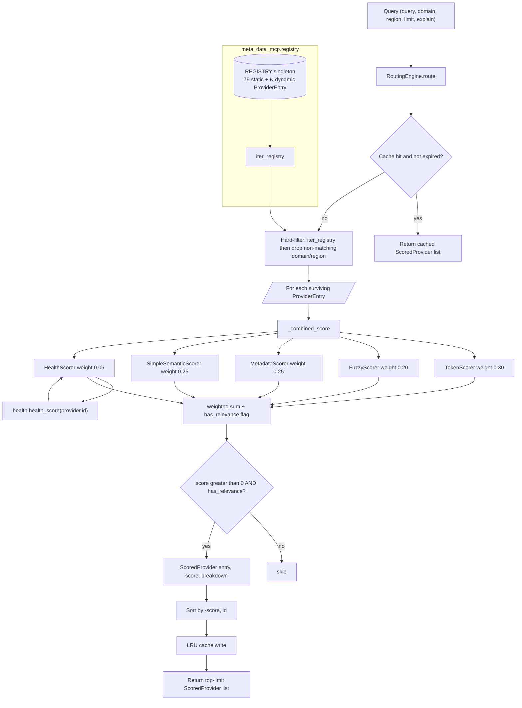

# C4-Code: Registry & Routing

## Overview
- **Name**: Registry & Routing
- **Description**: Static + dynamic provider catalog (`Registry`) plus a multi-criteria relevance-scoring engine (`RoutingEngine`) that ranks providers for free-text queries.
- **Location**: `meta_data_mcp/registry.py`, `meta_data_mcp/routing.py`
- **Language**: Python 3.12+
- **Purpose**: The single source of truth for "what providers exist" and the algorithm that picks the best one(s) for a free-text query.

## Code Elements

### `registry.py`

#### Controlled vocabularies
- `DOMAINS: tuple[str, ...]` (lines 26–57) — 29 canonical domain tags (e.g. `government`, `statistics`, `health`, `earth-science`, `security`, `scholarly`).
- `REGIONS: tuple[str, ...]` (lines 59–71) — 11 canonical region tags (`global`, `us`, `eu`, `uk`, `de`, `fr`, `nl`, `ch`, `ca`, `au`, `sg`).

#### `ProviderEntry` dataclass (lines 74–90)
Frozen dataclass — one row in the registry.

| Field | Type | Notes |
|---|---|---|
| `id` | `str` | canonical id (e.g. `global_arxiv`) |
| `server_name` | `str` | server/package name (e.g. `global-arxiv`) |
| `title` | `str` | human-readable title |
| `description` | `str` | one-line description |
| `domains` | `tuple[str, ...]` | from `DOMAINS` vocabulary |
| `regions` | `tuple[str, ...]` | from `REGIONS` vocabulary |
| `keywords` | `tuple[str, ...]` | search keywords |
| `homepage` | `str` | upstream homepage URL |
| `license_note` | `str = ""` | optional licensing/attribution note |
| `requires_env` | `tuple[str, ...] = ()` | required env vars (e.g. `NVD_API_KEY`) |

- `to_dict() -> dict[str, Any]` (lines 89–90) — `dataclasses.asdict` wrapper.

#### `Registry` dataclass (lines 1107–1206)
Unified container replacing the prior bimodal `REGISTRY: tuple + DYNAMIC_REGISTRY: list` surface. Holds static (compile-time) and dynamic (runtime-registered) entries in a single ordered list.

Private storage:
- `_entries: list[ProviderEntry]` (line 1123)
- `_by_id: dict[str, ProviderEntry]` (line 1124)
- `_static_count: int` (line 1125) — marks the frontier between static seed and dynamically-added entries.

Public methods:

| Method | Signature | Lines | Purpose |
|---|---|---|---|
| `from_static` | `@classmethod from_static(cls, entries: Iterable[ProviderEntry]) -> Registry` | 1127–1134 | Seed a Registry from compile-time entries; records `_static_count`. |
| `add` | `add(self, entry: ProviderEntry) -> bool` | 1136–1146 | Idempotent insert by id. Returns `True` if newly added, `False` if id already present. |
| `remove` | `remove(self, provider_id: str) -> bool` | 1148–1165 | Remove by id; decrements `_static_count` if removing a static entry so `dynamic()` slicing stays correct. |
| `find` | `find(self, provider_id: str) -> ProviderEntry \| None` | 1167–1176 | Resolve id, case-insensitive fallback. |
| `dynamic` | `dynamic(self) -> list[ProviderEntry]` | 1178–1184 | Returns entries past `_static_count` (runtime-registered only). New list per call. |
| `snapshot` | `snapshot(self) -> tuple[list, dict, int]` | 1186–1188 | Test helper. |
| `restore` | `restore(self, snap) -> None` | 1190–1197 | Test helper. |
| `__iter__` | `__iter__(self) -> Iterator[ProviderEntry]` | 1199–1200 | Iterates `_entries` in insertion order (statics first, dynamics after). |
| `__len__` | `__len__(self) -> int` | 1202–1203 | Total count. |
| `__contains__` | `__contains__(self, provider_id: object) -> bool` | 1205–1206 | `str`-only membership check via `_by_id`. |

**Static / dynamic split semantics**: statics are loaded once by `Registry.from_static(_STATIC_ENTRIES)` at module import and the count is frozen into `_static_count`. Anything added afterwards via `add()` (e.g. through `register_plugin()` during the autonomous-creation flow) is "dynamic". Iteration and `find()` are agnostic to the split; only `dynamic()` slices it.

#### `REGISTRY` module-level singleton (line 1211)
```python
REGISTRY: Registry = Registry.from_static(_STATIC_ENTRIES)
```
The canonical shared instance — tests, providers, routing, and the meta-server all use this single object.

#### Module-level helper functions
- `register_plugin(entry: ProviderEntry) -> None` (lines 1214–1222) — idempotent runtime registration; delegates to `REGISTRY.add`.
- `iter_registry() -> Iterable[ProviderEntry]` (lines 1225–1227) — yields every entry (static + dynamic).
- `_normalize(text: str) -> str` (lines 1230–1231) — `lower().strip()`.
- `find_providers(query, domain, region, limit=20)` (lines 1234–1287) — legacy/simple integer-score search used independently of `RoutingEngine`. Hard-filters by domain/region; per-token presence in haystack `+1`, exact keyword match `+2`; sort by `(-score, id)`; truncate to `limit`.
- `get_provider(provider_id) -> ProviderEntry | None` (lines 1290–1292) — wraps `REGISTRY.find` with normalization.
- `list_domains() -> list[str]` (lines 1295–1300) — distinct in-use domains.
- `list_regions() -> list[str]` (lines 1303–1308) — distinct in-use regions.
- `all_ids() -> list[str]` (lines 1311–1312).
- `_check_registry_vocabulary() -> Iterable[str]` (lines 1315–1324) — vocabulary linter for tests.

#### Static seed list (`_STATIC_ENTRIES`, lines 95–1104)
**75 static `ProviderEntry` rows**, alphabetical by id to match `pkgutil.iter_modules` order.

Geographic distribution (regions tag heads):
- `global_*` — large plurality (~38 entries): arXiv, BGPView, CoinGecko, Crossref, DBnomics, disease.sh, EPSS, Europe PMC, FAOSTAT, Frankfurter, GBIF, GDELT, IMF, iNaturalist, Met Museum, NVD CVE, OpenAlex, OECD, Open Library, Open-Meteo, OpenAQ, OpenSanctions, OpenSky, OSM Nominatim, OSV.dev, Overpass, PubChem, RCSB PDB, RIPEstat, UN Comtrade, UNESCO Heritage, WHO GHO, Wikidata, Wikipedia, World Bank, CERN.
- `us_*` — heavy (~21 entries): ArcGIS item, Cary, CISA KEV, CDC Socrata, Census Geocoder, ClinicalTrials, CourtListener, Data.gov, FAA NAS, Fayetteville, openFDA, Federal Register, NASA, HealthData.gov, NOAA AWC / NCEI / Tides, NC OneMap, NCDEQ GIS, Raleigh, SEC EDGAR, Treasury Fiscal, USGS Earthquake.
- `eu_*` — 3: Copernicus, ECB, Eurostat.
- `uk_*` — 3: data.gov.uk, legislation.gov.uk, ONS.
- `nl_*` — 4: CBS, NDOV, Rechtspraak, Tweede Kamer.
- Single-country: `au_data_gov`, `ca_open_gov`, `ch_sbb`, `de_db`, `fr_data_gouv`, `sg_data_gov`.

Domain distribution (heads): `government`, `statistics`, `economics`/`finance`, `health`, `scholarly`, `security`, `environment`/`earth-science`, `geo`/`geocoding`, `weather`, `transit`, `aviation`, `culture`/`knowledge`/`books`, `legal`, `biodiversity`/`biology`/`chemistry`, `physics`/`astronomy`/`space`, `networking`, `crypto`, `news`, `agriculture`, `trade`, `demographics`.

### `routing.py`

#### Module helpers
- `_tokenize(text: str | None) -> set[str]` (lines 32–36) — lowercase `[a-z0-9]+` term set.
- `_normalize_filter(value: str | None) -> str | None` (lines 39–41).

#### `ScoredProvider` dataclass (lines 44–50)
Frozen dataclass.
- `entry: ProviderEntry`
- `score: float`
- `breakdown: dict[str, float] | None = None` — populated only when `explain=True`; maps each scorer name to its raw 0.0–1.0 strategy score (e.g. `{"token": 0.66, "fuzzy": 0.0, "metadata": 0.5, "semantic": 0.1, "health": 1.0}`).

#### `Scorer` abstract base (lines 53–59)
`async score(query, provider) -> float` — each strategy returns a normalized 0.0–1.0 score.

#### Score components
| Class | Lines | Component | What it measures |
|---|---|---|---|
| `TokenScorer` | 62–98 | text match | per-token presence in concatenated id/title/description/keywords/domains/regions haystack, +2 keyword bonus, normalized to `min(score/(3*n_tokens), 1.0)`. |
| `FuzzyScorer` | 101–125 | text match (typo-tolerant) | best `difflib.SequenceMatcher` ratio across id/title/keywords; threshold `0.6`, returned as `best_ratio - 0.4`. |
| `MetadataScorer` | 128–152 | domain + region match | `+0.5` per provider domain whose tokens are a subset of query tokens, `+0.3` per region; capped at `1.0`. |
| `SimpleSemanticScorer` | 155–176 | text match (semantic) | Jaccard similarity between query terms and `description + keywords` terms. |
| `HealthScorer` | 179–190 | health | Delegates to `meta_data_mcp.health.health_score(provider_id)`; 1.0 = no known failures, decays with recent failures and recovers over time. Local import inside `score()` to avoid an import cycle. |

#### `RoutingEngine` class (lines 193–402)

Constructor `__init__(scorers=None, weights=None, cache_size=1000, cache_ttl_seconds=3600)` (lines 200–250).

**Default scorers** (lines 215–229):
```python
{"token": TokenScorer(), "fuzzy": FuzzyScorer(),
 "metadata": MetadataScorer(), "semantic": SimpleSemanticScorer(),
 "health": HealthScorer()}
```

**Default weights** (lines 231–240) — normalized to sum to 1 after the constructor (lines 243–245):
```python
{"token": 0.3, "fuzzy": 0.2, "metadata": 0.25, "semantic": 0.25, "health": 0.05}
```

**Health weight**: **`0.05`** at line 239. Per the comment at lines 236–238, Phase 3 bumped this from `0.0` → `0.05`; the change is pinned by `tests/test_health.py::test_default_engine_health_weight_is_nonzero` so a future revert is intentional. This is small enough that health does not dominate ranking but is enough to de-prioritise providers in active failure.

Cache: an `OrderedDict` LRU keyed by MD5 of `(query|domain|region|explain)`, with TTL `cache_ttl_seconds`. Guarded by `asyncio.Lock`.

Public methods:

| Method | Signature | Lines |
|---|---|---|
| `route` | `async route(query=None, domain=None, region=None, limit=20, explain=False) -> list[ScoredProvider]` | 264–346 |
| `_cache_key` | `_cache_key(query, domain, region, explain) -> str` | 252–262 |
| `_passes_filters` | `_passes_filters(provider, domain, region) -> bool` | 348–365 |
| `_combined_score` | `async _combined_score(query, provider, explain) -> tuple[float, dict[str,float] \| None, bool]` | 367–402 |

`route()` flow (lines 264–346):
1. **Cache lookup** keyed by `_cache_key` (lines 287–297); on hit within TTL, move-to-end and return.
2. **Hard filters**: iterate `iter_registry()` (so dynamically-registered plugins show up without restart), drop entries whose `domains` / `regions` don't include the filter (lines 303–305).
3. **Score loop** (lines 314–336): for each surviving provider, if query is non-empty call `_combined_score`, else assign `score = 1.0` and `has_relevance = True`. Only append `ScoredProvider` when `score > 0 and has_relevance`.
4. **Sort** by `(-score, id)` (line 339).
5. **Cache write** with LRU eviction (lines 341–344), truncate to `limit` and return.

`_combined_score` (lines 367–402): iterate scorers, skipping any with weight `0.0`; accumulate `weight * strategy_score`; record per-scorer score into `breakdown` when `explain=True`; track `has_relevance` flag — `True` only if a *non-health* scorer fires positive. This guard exists because every unrecorded provider has a baseline health score of `1.0`, so without it the Phase-3 health bump would make every provider clear `score > 0` even for nonsense queries (regressing the "find-providers returns 0 for nonsense queries" contract, pinned by `tests/providers/test_meta_data_mcp.py::test_find_providers_no_match_returns_empty`).

#### Module-level wrapper
- `find_providers_sophisticated(query, domain, region, limit=20, explain=False)` (lines 406–419) — backwards-compatible helper that builds a default `RoutingEngine`, calls `route`, and unwraps to `list[ProviderEntry]`.

## Dependencies

- **Internal**:
  - `meta_data_mcp.registry` (imported by `routing.py` line 27 for `ProviderEntry` and `iter_registry`).
  - `meta_data_mcp.health` (lazy-imported inside `HealthScorer.score`, `routing.py` line 188) — supplies the per-provider reliability signal.
- **External / stdlib**:
  - `dataclasses` (`dataclass`, `field`, `asdict`) — registry/routing dataclasses.
  - `re` — `_tokenize` regex.
  - `difflib` — fuzzy matching in `FuzzyScorer`.
  - `hashlib` — cache keying.
  - `asyncio` — `Lock` for cache; `async` scorer interface.
  - `collections.OrderedDict` — LRU cache.
  - `abc`, `logging`, `time`, `typing`.
- Pydantic is **not** used in these two modules (dataclasses-only).

## Relationships


