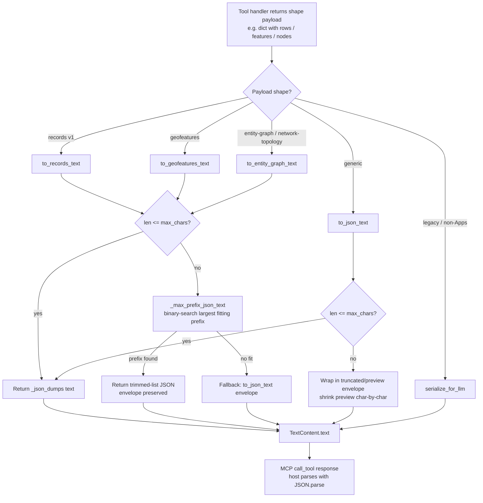
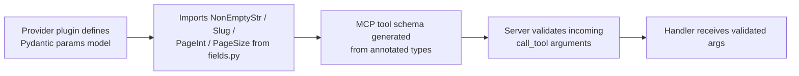

# C4-Code: Serialization & Fields

## Overview

- **Name**: Serialization & Fields
- **Description**: Tool-result serializers that produce deterministic, size-bounded JSON text for MCP responses, plus shared Pydantic field aliases used by provider parameter models.
- **Location**:
  - `/Users/lderek/GitHub/meta-data-mcp/meta_data_mcp/serialize.py`
  - `/Users/lderek/GitHub/meta-data-mcp/meta_data_mcp/fields.py`
- **Language**: Python 3 (typed, `from __future__ import annotations`)
- **Purpose**: Guarantee that every tool/resource text payload returned over MCP is (a) valid JSON the host can `JSON.parse`, (b) within the response-size budget, and (c) shape-preserving for the bundles that consume it. `fields.py` complements this by codifying common parameter constraints (slugs, page sizes) once, so provider plugins do not re-declare them per tool.

---

## Code Elements

### `serialize.py`

| Symbol | Signature | Description | Lines |
|---|---|---|---|
| `MAX_RESPONSE_CHARS` | `int = 20_000` | Default character budget for every tool/resource text response. | 32 |
| `serialize_for_llm` | `serialize_for_llm(data: Any) -> str` | Legacy generic serializer. `json.dumps(..., default=str, ensure_ascii=False)` then mid-string slice to `MAX_RESPONSE_CHARS`. Kept for tools that do not bind to an MCP Apps shape. | 35–44 |
| `_json_dumps` | `_json_dumps(payload: Any) -> str` | Internal canonical-dumps helper. `ensure_ascii=False`, `default=str`, `sort_keys=True`, `separators=(",", ":")` — every kwarg is load-bearing for stable output bytes. | 47–54 |
| `to_json_text` | `to_json_text(payload: Any, max_chars: int \| None = None) -> str` | Generic shape-agnostic serializer that always returns valid JSON. On overflow, replaces the payload with `{"truncated": true, "original_length": N, "max_chars": M, "preview": "..."}` and shrinks `preview` until it fits. Falls back to `{"truncated": true}` then `{}` if even the envelope exceeds `max_chars`. Raises `ValueError` for `max_chars < 2` or impossibly tight budgets. | 57–99 |
| `_max_prefix_json_text` | `_max_prefix_json_text(items, build_payload, max_chars) -> str \| None` | Binary-searches the largest list prefix whose serialized payload fits within `max_chars`. Shared engine for all shape-bound serializers. Returns `None` if even a zero-length prefix overflows. | 102–119 |
| `to_records_text` | `to_records_text(payload: Any, max_chars: int = MAX_RESPONSE_CHARS) -> str` | Shape-bound serializer for the `ui://meta-data-mcp/shape/records/v1` envelope. Trims `rows` to the largest fitting prefix; preserves `schema` / `default_facets`. Falls back to `to_json_text` only for non-dict payloads. | 122–161 |
| `to_geofeatures_text` | `to_geofeatures_text(payload: Any, max_chars: int = MAX_RESPONSE_CHARS) -> str` | Shape-bound serializer for geofeatures. Handles both option B (`{"features": [...]}`) and option A native GeoJSON (`{"features": {"type": "FeatureCollection", "features": [...]}}`); trims the inner list. | 164–209 |
| `to_entity_graph_text` | `to_entity_graph_text(payload: Any, max_chars: int = MAX_RESPONSE_CHARS) -> str` | Shape-bound serializer for `entity-graph` / `network-topology` envelopes (`{"nodes": [...], "edges": [...]}`). Trims `nodes` to the largest fitting prefix, then drops any `edges` referencing dropped node ids so the graph stays internally consistent. | 212–267 |
| `__all__` | list | Public exports: `MAX_RESPONSE_CHARS`, `serialize_for_llm`, `to_entity_graph_text`, `to_geofeatures_text`, `to_json_text`, `to_records_text`. | 270–277 |

### `fields.py`

| Symbol | Signature | Description | Lines |
|---|---|---|---|
| `NonEmptyStr` | `Annotated[str, Field(min_length=1)]` | A required string that must contain at least one character. | 11 |
| `Slug` | `Annotated[str, Field(pattern=r"^[a-z0-9-]+$", min_length=1)]` | URL-safe lowercase-alphanumerics-and-hyphens identifier. | 14 |
| `PageInt` | `Annotated[int, Field(default=1, ge=1)]` | 1-indexed page number, defaults to `1`. | 17 |
| `PageSize` | `Annotated[int, Field(default=20, ge=1, le=1000)]` | Page-size parameter, default `20`, bounded `1..1000` inclusive. | 20 |

---

## Size Budget Mechanism

The shape-bound serializers (`to_records_text`, `to_geofeatures_text`, `to_entity_graph_text`) share a single algorithm:

1. Serialize the full payload via `_json_dumps`.
2. If `len(text) <= max_chars`, return as-is.
3. If the payload is not a dict envelope, defer to `to_json_text` (which always produces valid JSON via the truncation envelope).
4. Otherwise, locate the bounded list (`rows`, `features`, or `nodes`) and call `_max_prefix_json_text`, which binary-searches the largest prefix whose serialized form fits within `max_chars`. The remainder of the envelope (e.g. `schema`, `default_facets`, FeatureCollection metadata) is preserved verbatim around the trimmed list.
5. For `to_entity_graph_text` only, after trimming `nodes`, any `edges` whose `source` or `target` references a dropped node id are filtered out — preserving graph integrity at the cost of edge counts.
6. If even a zero-length prefix overflows the budget, fall back to `to_json_text(payload, max_chars=max_chars)`.

**What gets truncated when payloads exceed the budget:**

- `serialize_for_llm` → mid-string slice (legacy; may produce invalid JSON).
- `to_json_text` → entire payload replaced by `{"truncated": true, "original_length": N, "max_chars": M, "preview": "<head of the original JSON>"}`; `preview` is whittled down character by character. Ultimate fallbacks: `{"truncated": true}` then `{}`.
- `to_records_text` → `rows` list trimmed; `schema` and `default_facets` preserved.
- `to_geofeatures_text` → `features` list trimmed (works for both option A and option B envelopes); FeatureCollection wrapper preserved when present.
- `to_entity_graph_text` → `nodes` list trimmed; orphan `edges` then dropped.

The contract guarantee: **every code path returns valid JSON within `max_chars` bytes**, so MCP Apps bundles using `JSON.parse` always render something rather than failing to a blank surface.

---

## Dependencies

### Internal
- `serialize.py` — none (self-contained). Re-exported by `meta_data_mcp.utils` so legacy call sites keep working post-H1 hygiene split.
- `fields.py` — none. Imported by provider plugin parameter models throughout `meta_data_mcp/providers/*`.

### External
- `serialize.py` — `json` (stdlib), `typing` (stdlib).
- `fields.py` — `typing.Annotated` (stdlib), `pydantic.Field`.

---

## Relationships

### Serializer flow: handler result → size-bounded serializer → MCP response

### `fields.py` usage flow

---

## Notes

- The split out of `utils.py` is documented in the v2.1 hygiene pass (architecture review §H1, commit `c0376d3`). `meta_data_mcp.utils` re-exports every public symbol from `serialize.py` so existing callers continue to work unchanged.
- The "single source of truth" framing in the module docstring is deliberate: MCP Apps bundles parse with `JSON.parse`, and any invalid JSON makes them render an empty surface. These helpers are the contract boundary for "shaped payload, size-bounded, host can always parse."
- `_json_dumps` uses `sort_keys=True` + compact `separators` so the serialized form is byte-stable across Python runs. This deterministic output is important because it is the same envelope hashed by the provenance module (see `c4-code-provenance.md`).
