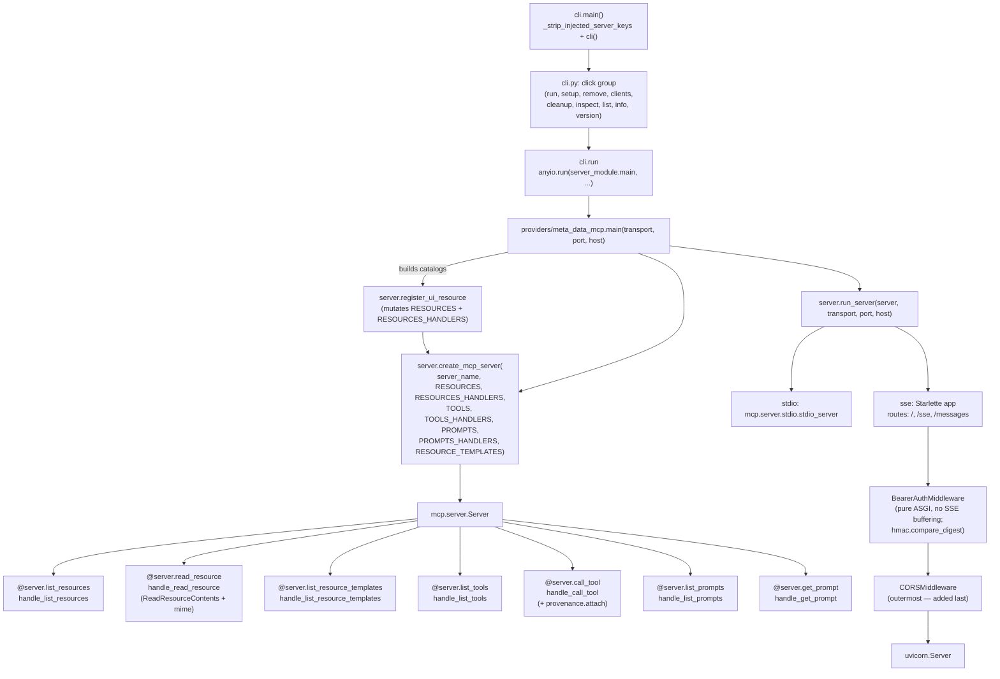

# C4-Code: Server Bootstrap & CLI

## Overview
- **Name**: Server Bootstrap & CLI
- **Description**: Assembles a low-level `mcp.server.Server` from caller-supplied resources/tools/prompts dicts, registers protocol handlers, gates SSE behind bearer auth, and exposes a Click-based CLI for run/setup/inspect lifecycle commands.
- **Location**: `meta_data_mcp/server.py`, `meta_data_mcp/cli.py`, `meta_data_mcp/utils.py`, `meta_data_mcp/__init__.py`
- **Language**: Python 3.12+
- **Purpose**: Provide a single bootstrap entry point that turns provider-built catalogs into a running MCP server (stdio or SSE), and a CLI that registers/unregisters the server in installed MCP clients without coupling to any specific provider.

## Code Elements

### `server.py`

#### `register_ui_resource` — function, lines 32–108
- **Signature**: `register_ui_resource(*, name: str, html: str, description: str, resources: list[types.Resource], resources_handlers: dict[str, Callable[[AnyUrl], str | bytes]], server_name: str = "meta-data-mcp", mime: str = "text/html;profile=mcp-app") -> str`
- **Description**: Registers a `ui://<server_name>/<name>` resource backed by static HTML by mutating the caller's `resources` list and `resources_handlers` dict in place; returns the fully-qualified URI.
- **Key invariants**:
  - URI shape is `ui://<server_name>/<name.lstrip('/')>` (line 92).
  - Default MIME must carry the `;profile=mcp-app` parameter or hosts reject the resource with `"Unsupported UI resource content format"` (lines 75–80).
  - Raises `ValueError` on empty `name` or URI collision in `resources_handlers` (lines 90–94).
  - Tools binding to the returned URI must use `_meta=` (the field alias), not `meta=` — the `Tool` model does not enable `populate_by_name` (lines 47–55).
- **Dependencies used**: `mcp.types.Resource`, `pydantic.AnyUrl`.

#### `create_mcp_server` — function, lines 111–260
- **Signature**: `create_mcp_server(server_name: str, resources: list[types.Resource] | None = None, resources_handlers: dict[str, Callable[[AnyUrl], str | bytes]] | None = None, tools: list[types.Tool] | None = None, tools_handlers: dict[str, Callable[[dict[str, Any] | None], Sequence[types.TextContent | types.ImageContent | types.EmbeddedResource]]] | None = None, prompts: list[types.Prompt] | None = None, prompts_handlers: dict[str, Callable[[dict[str, str] | None], types.GetPromptResult]] | None = None, resource_templates: list[types.ResourceTemplate] | None = None) -> Server`
- **Description**: Instantiates `mcp.server.Server(server_name)` and registers six protocol handlers as inner closures over the passed-in catalogs.
- **Registered inner handlers** (closures that share the captured `_resources`, `_tools`, etc.):
  - `handle_list_resources` — lines 163–165; returns `_resources`.
  - `handle_read_resource` — lines 176–209; looks up the URI in `_resources_handlers`, invokes it, wraps the payload in `ReadResourceContents(content=..., mime_type=mime)` so the registered MIME survives transit. Invariant: "the host reads the envelope's `mimeType`, not the catalog entry's" (lines 187–190).
  - `handle_list_resource_templates` — lines 212–214; returns `_resource_templates`.
  - `handle_list_tools` — lines 217–219; returns `_tools`.
  - `handle_call_tool` — lines 222–238; awaits `_tools_handlers[name](arguments)` and, if `provenance.is_enabled()`, calls `provenance.attach(result, tool_name=name, arguments=arguments)` before returning.
  - `handle_list_prompts` — lines 241–243; returns `_prompts`.
  - `handle_get_prompt` — lines 246–258; awaits `_prompts_handlers[name](arguments)`.
- **Key invariants**:
  - Inputs default to empty mutable defaults inside the function — never module-level — but the same list/dict objects passed by the caller are captured by reference. Effectively: TOOLS and TOOLS_HANDLERS are the same list/dict objects passed to `create_mcp_server`, so provider modules that mutate the lists after server creation will see those mutations served (lines 151–157).
  - `_mime_by_uri` lookup is built once at bootstrap to avoid rescanning `_resources` on every read (lines 172–174); fallback `text/plain` is defensive (every codepath sets MIME explicitly).
  - `AttributeError` is the documented "not found" signal for unknown tool/prompt/resource names (lines 205, 228, 252).
- **Dependencies used**: `mcp.server.Server`, `mcp.types`, `mcp.server.lowlevel.helper_types.ReadResourceContents`, `pydantic.AnyUrl`, `meta_data_mcp.provenance`.

#### `BearerAuthMiddleware` — class, lines 263–314
- **`__init__(self, app: Any, token: str, protected_prefixes: Sequence[str] = ("/sse", "/messages")) -> None`** — lines 271–279.
- **`__call__(self, scope: dict, receive: Callable, send: Callable) -> None`** — lines 281–314.
- **Description**: ASGI middleware that requires `Authorization: Bearer <token>` on paths starting with any protected prefix; lets all other traffic (including the health-check `/`) through untouched.
- **Key invariants**:
  - "Pure ASGI middleware (not BaseHTTPMiddleware) so it does not buffer streaming SSE responses" — class docstring, lines 263–269. The same invariant is reinforced by the placement note that `CORSMiddleware` is added last so it stays outermost and OPTIONS preflights are not rejected by this middleware (server.py lines 393–402).
  - Token comparison uses `hmac.compare_digest` against the presented credential (line 302) — constant-time, not `==`.
  - Non-HTTP scopes and unprotected paths short-circuit through `self.app` (lines 282–286).
  - Rejection returns `JSONResponse({"error": "unauthorized"}, status_code=401, headers={"WWW-Authenticate": 'Bearer realm="meta-data-mcp"'})` (lines 304–311).
- **Dependencies used**: `hmac`, `starlette.responses.JSONResponse` (imported lazily).

#### `run_server` — coroutine, lines 317–415
- **Signature**: `async def run_server(server: Server, transport: str = "stdio", port: int = 8000, host: str = "127.0.0.1")`
- **Description**: Dispatches `stdio` or `sse` transports. `stdio` wires `mcp.server.stdio.stdio_server()` directly into `server.run(...)`. `sse` builds a Starlette app with `/`, `/sse`, and `/messages` routes, optionally wraps it in `BearerAuthMiddleware`, always wraps it (outermost) in `CORSMiddleware`, and serves it via `uvicorn`.
- **Key invariants**:
  - "if `META_DATA_MCP_AUTH_TOKEN` is set, requests to `/sse` and `/messages` must include `Authorization: Bearer <token>`. When unset, SSE is served unauthenticated (logs a startup warning)" — docstring lines 323–325; implemented lines 380–391.
  - `CORSMiddleware` is added AFTER `BearerAuthMiddleware` (lines 396–402) so it is outermost; OPTIONS preflights are answered with CORS headers before the bearer check.
  - `SseServerTransport("/messages")` is created once (line 342) and shared by both the `/sse` endpoint and the `/messages` mount.
  - Unknown `transport` raises `ValueError` (line 415).
- **Dependencies used**: `mcp.server.stdio`, `mcp.server.sse.SseServerTransport`, `starlette.applications.Starlette`, `starlette.middleware.cors.CORSMiddleware`, `starlette.routing`, `starlette.responses.JSONResponse`, `uvicorn`, `os.getenv`.

#### Module exports — `__all__` at lines 418–423
`BearerAuthMiddleware`, `create_mcp_server`, `register_ui_resource`, `run_server`.

### `cli.py`

#### `ClientSpec` — dataclass, lines 59–77
- **Fields**: `key: str`, `label: str`, `detect_fn: Callable[[], Path | None]`, `config_path_fn: Callable[[], Path | None]`.
- **Description**: Frozen dataclass describing a supported MCP client and where its `mcpServers` JSON config lives. `detect_fn` returns the path that must exist for the client to count as installed; `config_path_fn` returns the file to write.

#### Client path resolvers — functions, lines 79–113
`_claude_desktop_config_path` (79–88), `_claude_desktop_detect` (91–93), `_claude_code_path` (96–97), `_cursor_path` (100–101), `_windsurf_path` (104–105), `_gemini_path` (108–109), `_lm_studio_path` (112–113). Each returns the canonical config path for one client; Claude Desktop returns `None` on Linux.

#### `CLIENTS` — dict, lines 116–153
Static registry mapping client key → `ClientSpec` for the six supported clients (claude-desktop, claude-code, cursor, windsurf, gemini, lm-studio).

#### `_detect_installed_clients` — function, lines 156–163
- **Signature**: `_detect_installed_clients() -> list[ClientSpec]`
- **Description**: Returns the subset of `CLIENTS` whose `detect_fn()` path exists on disk.

#### `_config_path` — function, lines 166–177
- **Signature**: `_config_path() -> Path`
- **Description**: Back-compat alias for the Claude Desktop config path, used by the `cleanup` command (the only command still Claude-Desktop-only).

#### `_backup_config` / `_load_config` / `_load_config_safe` — functions, lines 180–209
- `_backup_config(config_path: Path) -> None` — writes `<config>.json.bak` (180–182).
- `_load_config(config_path: Path) -> dict` — exits the process on invalid JSON (185–195).
- `_load_config_safe(config_path: Path) -> dict | None` — returns `None` on invalid JSON so the multi-client setup loop can skip a corrupted file without aborting (198–209).

#### `_server_entry` — function, lines 212–231
- **Signature**: `_server_entry(use_local: bool, repo_root: Path) -> dict`
- **Description**: Builds the `mcpServers[...]` entry. Local mode uses `uv --directory <repo_root> run meta-data-mcp run --transport stdio` plus `OTEL_SDK_DISABLED=true`. Global mode uses `uvx meta-data-mcp run --transport stdio`.

#### `_migrate_legacy_entries` — function, lines 234–260
- **Signature**: `_migrate_legacy_entries(config: dict) -> list[str]`
- **Description**: Removes legacy keys (`opendata-mcp-*` plus the two double-prefixed mistakes `opendata-mcp-meta-data-mcp` and `opendata-mcp-opendata-mcp-all`) from `config["mcpServers"]` in place and returns the sorted list of removed keys.

#### `cli` — Click group, lines 268–272
- **Decoration**: `@click.group(context_settings={"allow_extra_args": True, "ignore_unknown_options": True})`
- **Description**: Root Click group; extra args are tolerated so Claude Desktop's injected positional args do not crash the CLI.

#### `run` — command, lines 275–307
- **Options**: `--transport stdio|sse` (default `sse`), `--port` (default `8000`), `--host` (default `127.0.0.1`).
- **Description**: Imports `meta_data_mcp.providers.meta_data_mcp` and calls `anyio.run(server_module.main, transport, port, host)`. Stack-traces and exits non-zero on failure.

#### `version` — command, lines 310–313
Prints `meta-data-mcp version: <__version__>`.

#### `list_plugins` — command (`list`), lines 316–340
Walks `meta_data_mcp.providers` via `pkgutil.iter_modules`, filters out `__template__`, `__init__`, `utils`, `meta_data_mcp`, and prints the remaining names.

#### `info` — command, lines 343–374
With no `--plugin`, prints the meta-server overview. With `--plugin <name>`, `importlib.import_module(f"meta_data_mcp.providers.{plugin}")` and prints its `__doc__`.

#### `setup` — command, lines 377–499
- **Options**: `--local`, `--force`, `--print-json`, `--client KEY|all|None`.
- **Description**: Resolves target clients (explicit, `all`, or detected), builds the server entry via `_server_entry`, and writes it to each target via `_write_server_to_client`. With `--print-json`, prints the JSON snippet (plus a remote-SSE snippet if `META_DATA_MCP_AUTH_TOKEN` is set) and exits without touching any file. Exits 1 if no clients were configured.

#### `_write_server_to_client` — function, lines 502–554
- **Signature**: `_write_server_to_client(spec: ClientSpec, config_path: Path, entry: dict, *, force: bool) -> bool`
- **Description**: Mkdir-p's the parent, loads the existing JSON via `_load_config_safe`, validates that the top level and `mcpServers` are dicts, calls `_migrate_legacy_entries`, prompts on collision unless `--force`, backs up, writes, and prints a per-client status line. Returns `True` only on a successful write.

#### `remove` — command, lines 557–629
- **Options**: `--client KEY|all|None`.
- **Description**: For each target whose config exists and contains `SERVER_KEY`, removes the entry, prunes an empty `mcpServers`, backs up, and rewrites the file.

#### `list_clients_command` — command (`clients`), lines 632–658
Prints each supported client with one of four statuses: `unsupported on this OS`, `✓ configured`, `• installed (not configured)`, or `not detected`, plus the resolved config path.

#### `cleanup` — command, lines 661–717
- **Options**: `--apply` (default is dry-run).
- **Description**: Operates only on the Claude Desktop config (`_config_path()`); finds legacy `opendata-mcp-*` keys and removes them when `--apply` is passed.

#### `inspect` — command, lines 720–773
Verifies `npx` exists, builds the same local/global stdio command shape as `setup`, and runs `npx -y @modelcontextprotocol/inspector <server_cmd>` against it.

#### `_strip_injected_server_keys` — function, lines 781–808
- **Description**: Defensive shim that strips Claude Desktop's habit of appending the server's own `mcpServers` key onto `sys.argv` when it restarts a server. Real subcommand names that happen to collide with a server key are preserved exactly once via `already_preserved`. Wrapped in a broad `except Exception: pass` because failing the parser would be worse than tolerating a stray arg.

#### `main` — function, lines 811–813
Calls `_strip_injected_server_keys()` then invokes `cli()`. Also the `if __name__ == "__main__":` entry (lines 816–817).

### `utils.py`

**This module is a back-compat shim** (file docstring, lines 1–20). It exists so the 94 in-repo call sites that historically did `from meta_data_mcp.utils import ...` keep working after the v2.1 hygiene split. New code should import from the focused modules directly.

- **Module-level `import httpx` / `import time`** — lines 29–30. Retained because tests patch `utils.time.monotonic` and `utils.httpx.get` to control the transport from the outside; both modules are singletons, so patching through `utils` mutates the same object `transport` uses.
- **Re-exports from `meta_data_mcp.serialize`** (lines 32–39): `MAX_RESPONSE_CHARS`, `serialize_for_llm`, `to_entity_graph_text`, `to_geofeatures_text`, `to_json_text`, `to_records_text`.
- **Re-exports from `meta_data_mcp.server`** (lines 40–45): `BearerAuthMiddleware`, `create_mcp_server`, `register_ui_resource`, `run_server`.
- **Re-exports from `meta_data_mcp.transport`** (lines 46–50): `_response_cache` (kept reachable so tests can call `utils._response_cache.clear()`), `http_get`, `http_post`.
- **`__all__`** at lines 52–65 enumerates the public surface.

### `__init__.py`
- **`__version__ = "2.1.0"`** — line 1. This is the only content of the file; the value is read by `cli.version` and by `cli.info` for the overview banner.

## Dependencies

### Internal (other `meta_data_mcp` modules this unit imports from)
- `meta_data_mcp.provenance` — used by `create_mcp_server.handle_call_tool` to conditionally attach provenance to tool results (server.py line 27 import; lines 236–237 usage).
- `meta_data_mcp.providers.meta_data_mcp` — imported lazily by `cli.run` to obtain `server_module.main` (cli.py line 299).
- `meta_data_mcp.providers` — imported by `cli.list_plugins` to enumerate plugins (cli.py line 325).
- `meta_data_mcp.serialize` — re-exported through `utils.py` (lines 32–39).
- `meta_data_mcp.transport` — re-exported through `utils.py` (lines 46–50).
- `meta_data_mcp` — `__version__` is imported by `cli.py` line 39.

### External (PyPI)
- `mcp` — `mcp.server.Server`, `mcp.types`, `mcp.server.lowlevel.helper_types.ReadResourceContents`, `mcp.server.stdio.stdio_server`, `mcp.server.sse.SseServerTransport`.
- `pydantic` — `AnyUrl`.
- `anyio` — `anyio.run` in `cli.run`.
- `click` — CLI framework (group, options, echo, confirm, Choice).
- `starlette` — `Starlette`, `Route`, `Mount`, `CORSMiddleware`, `JSONResponse` for the SSE app.
- `uvicorn` — `Config` and `Server` for serving the SSE app.
- `httpx` — re-exported through `utils.py` for back-compat patching.
- Standard library: `hmac`, `logging`, `os`, `json`, `platform`, `sys`, `pathlib`, `dataclasses`, `pkgutil`, `importlib`, `shutil`, `subprocess`, `typing`, `traceback`, `time`.

## Relationships

