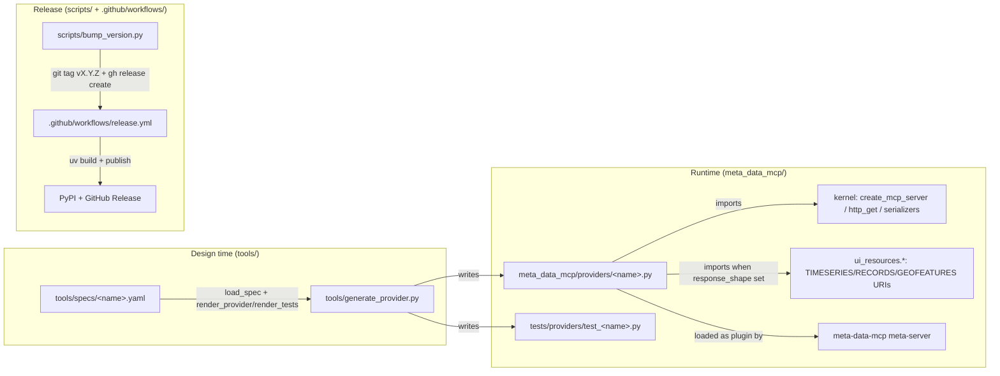

# C4-Code: Plugin Generator & Scripts

## Overview
- **Name**: Plugin Generator & Scripts
- **Description**: Offline tooling — declarative YAML provider specs scaffold the 78 provider modules under `meta_data_mcp/providers/`; release and ops scripts handle version bumps, PR gating, and systemd install.
- **Location**: `tools/`, `scripts/`
- **Language**: Python 3.12+ (PyYAML only), YAML, Bash
- **Purpose**: Reduce per-provider implementation cost — most providers are generated from a declarative spec rather than hand-written, so contributors describe an HTTP endpoint and the generator produces both the provider module and a test stub that conform to the kernel's plugin contract.

These tools run at **design time only** — they are not part of the deployed server runtime.

## Generator (`tools/generate_provider.py`)

Single-file scaffolder. ~740 lines. Depends only on the Python standard library plus PyYAML.

### Public API

```python
def load_spec(path: Path) -> dict[str, Any]                # parse + validate YAML
def render_provider(spec: dict[str, Any]) -> str           # emit provider module source
def render_tests(spec: dict[str, Any]) -> str              # emit test stub source
def generate(spec_path: Path, *, dry_run: bool, force: bool) -> dict[str, str]
def main(argv: Iterable[str] | None = None) -> int         # CLI entry point
```

### CLI

```
uv run python tools/generate_provider.py <spec.yaml> [--dry-run] [--force]
```

- `--dry-run` — print generated code to stdout instead of writing
- `--force` — overwrite existing files (default refuses)

### Input
A YAML spec from `tools/specs/`. See **Spec schema** below.

### Output
Two files (or stdout under `--dry-run`):
- `meta_data_mcp/providers/{spec.id}.py` — provider module conforming to the plugin contract (exposes `RESOURCES`, `RESOURCES_HANDLERS`, `TOOLS`, `TOOLS_HANDLERS`, `main()`)
- `tests/providers/test_{spec.id}.py` — pytest stubs: one success-path + one HTTP-error test per tool, mocking `httpx.get`

Generated providers import the shared kernel helpers from `meta_data_mcp.utils`: `create_mcp_server`, `http_get`, `run_server`, plus `serialize_for_llm` (default) or shape-specific serializers (`to_records_text`, `to_geofeatures_text`, `to_json_text`) when a `response_shape` is bound.

### Spec schema (validated by `load_spec`)

Required top-level keys (`SpecError` raised on violation):
- `id` — lowercase snake_case, regex `^[a-z][a-z0-9_]*$` (becomes the module filename)
- `server_name` — wire-level MCP server name (becomes `PROVIDER_ID`)
- `base_url` — URL prefix prepended to each tool's endpoint
- `description` — human-readable summary (goes into the module docstring)
- `tools` — non-empty list

Optional top-level keys:
- `homepage` — link emitted into module docstring
- `requires_env` — list of env-var names **or** a mapping `{ENV_VAR: query_param_name}`; generator emits a `_require_key()` helper that injects each variable into the query at request time
- `domains`, `regions`, `keywords`, `title` — discovery metadata consumed by the registry / meta-server (not used by the generator itself)

Per-tool keys:
- `name` (required) — kebab-case wire name, converted to `snake_case` Python ids
- `description` (required)
- `endpoint` (required) — path appended to `base_url`; `{path_param}` placeholders are detected via `PATH_PARAM_RE` and bound to Pydantic params of the same name
- `response_format` — `"json"` (default) or `"text"`
- `response_shape` — `"none"` (default), `"timeseries"`, `"geofeatures"`, or `"records"`; when set, the generator imports the corresponding URI constant from `meta_data_mcp.ui_resources.*`, emits `_meta={"ui": {"resourceUri": <URI>}}` on the `Tool(...)` registration (MCP Apps Phase 6a), and wires in the shape-specific size-bounded serializer plus a `TODO` for the provider-author to write the response→shape adapter
- `params` — list of `{name, type, required, default, description}`; `type` in {`str`, `int`, `float`, `bool`} via `TYPE_MAP`

### What the generator deliberately does NOT handle
Per the module docstring, the generator is narrow: HTTP GET with simple query/path params only. Auth headers, POST bodies, multi-step transforms, and provider-specific shape adapters are left to hand-coded providers or post-generation edits. The `response_shape` binding emits a TODO comment because shape mappings (SDMX vs JSON-stat vs native) are too provider-specific to auto-generate safely.

## Specs (`tools/specs/`)

**17 spec files** plus a `README.md` reference. Naming convention `<region>_<provider>.yaml`:

| File | Notes |
|---|---|
| `example_weather_alert.yaml` | Reference example |
| `global_epss.yaml`, `global_faostat.yaml`, `global_gdelt.yaml`, `global_nvd_cve.yaml`, `global_openaq.yaml`, `global_opensanctions.yaml`, `global_osv_dev.yaml`, `global_un_comtrade.yaml` | Global providers |
| `us_arcgis_item.yaml`, `us_cary.yaml`, `us_cisa_kev.yaml`, `us_fayetteville.yaml`, `us_healthdata_gov.yaml`, `us_nc_onemap.yaml`, `us_ncdeq_gis.yaml`, `us_raleigh.yaml` | US/regional providers |
| `README.md` | Full YAML reference + "what generator won't do" |

### Representative example — `global_nvd_cve.yaml`

Three tools (`nvd-search-cves`, `nvd-get-cve`, `nvd-cve-history`) against `https://services.nvd.nist.gov`. Each tool declares an endpoint plus a list of typed `params` with `required` flags, types (`str`, `int`), defaults, and descriptions. Discovery metadata (`domains: [security, government]`, `regions: [us, global]`, nine `keywords`) lets the meta-server's `opendata-find-providers` tool surface this plugin without any registry hand-editing.

### Simpler example — `us_cary.yaml`
Demonstrates path parameters: `endpoint: /api/views/{dataset_id}` with a matching required `dataset_id` param produces `url = f"{BASE_URL}/api/views/{params.dataset_id}"` in the generated fetch function.

## Scripts (`scripts/`)

| File | Purpose | Invocation |
|---|---|---|
| `bump_version.py` | Rewrite `__version__` in `meta_data_mcp/__init__.py`, commit, tag `vX.Y.Z`, push, and create a GitHub release via `gh release create --generate-notes`. The release event then triggers `.github/workflows/release.yml`. | `./scripts/bump_version.py {major\|minor\|patch}` |
| `pr_check.sh` | Codify the seven-step merge gate from `docs/PR_MERGE_CHECKLIST.md` — exits non-zero on the first failure so the steps cannot be forgotten. Requires authenticated `gh` and `jq`. | `scripts/pr_check.sh <PR_NUMBER>` or `make pr-check N=<n>` |
| `install-systemd-service.sh` | Production install: creates a `mcp` service user, installs the package via `uv`, generates a bearer token, writes `/etc/meta-data-mcp/env` and a systemd unit, and (optionally) starts the service. Re-runnable; existing files backed up to `.bak`. | `curl -fsSL …/install-systemd-service.sh \| sudo bash -s -- --start` or `sudo ./scripts/install-systemd-service.sh --start` |

## Dependencies

**Runtime (offline):**
- Internal: none — the generator imports nothing from `meta_data_mcp.*` (it only emits source that will later import the kernel)
- External (Python): `pyyaml` only
- External (shell scripts): `gh`, `jq`, `uv`, `git`, `systemd`/`systemctl` (install script only)

**No Jinja2** — the generator builds strings directly with f-strings and small `_render_*` helpers (`_render_field`, `_render_params_class`, `_render_fetch_fn`, `_render_handler`, `_render_registration`, `_render_tool_block`, `_render_env_helper`). This keeps the dependency surface minimal and the generated diff trivially auditable.

## Relationships



## Notes

- **Generator outputs are committed to git** — providers under `meta_data_mcp/providers/` are not regenerated at runtime; the YAML spec is the design-time source, the `.py` is the artifact actually shipped. Edits made after generation (custom adapters, auth helpers) are preserved because the generator refuses to overwrite without `--force`.
- **MCP Apps Phase 6a wiring** — when `response_shape` is set on a tool, the generator binds three things together: the `_meta.ui.resourceUri` on `Tool(...)`, a size-bounded serializer in the handler, and a `TODO` for the response→shape adapter. The author writes only the adapter; the wiring is mechanical.
- **`requires_env` accepts two forms** — a bare list (single env var, assumed to be `api_key` query param) or a mapping (multiple env vars to distinct query-param names). The generator raises on duplicate query-param names.
- **Release workflow** — `scripts/bump_version.py` is the human-driven step (run locally with `major`/`minor`/`patch`). It pushes the tag, which triggers `.github/workflows/release.yml` to build with `uv build`, verify `__version__` matches the tag, upload to the GitHub Release, and publish to PyPI via trusted publishing.
- **CI safety net** — `scripts/pr_check.sh` is the codified merge gate; the `Makefile` exposes it as `make pr-check N=<n>` so the seven-step checklist is impossible to forget.
