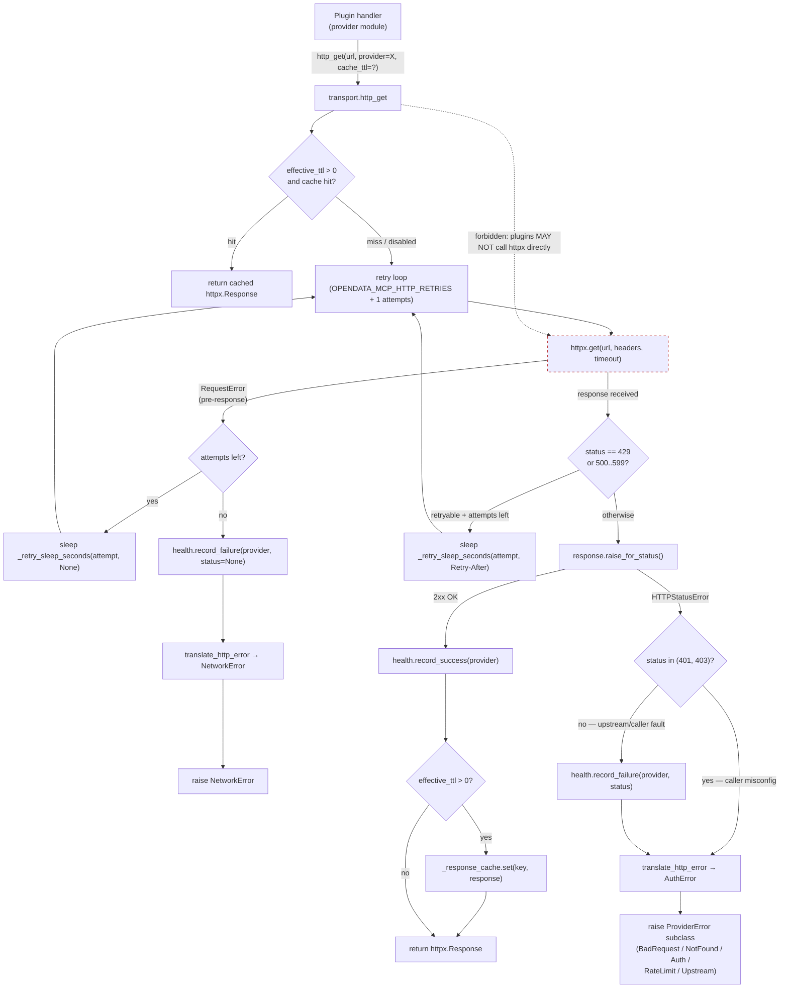

# C4-Code: HTTP Transport Kernel

## Overview
- **Name**: HTTP Transport Kernel
- **Description**: The mandatory `http_get(provider=)` / `http_post(provider=)` contract every plugin must route through, providing TTL response caching, in-memory provider health tracking, retry/backoff, and URL-redacted error translation to a stable `ProviderError` hierarchy.
- **Location**: `meta_data_mcp/transport.py`, `meta_data_mcp/errors.py`, `meta_data_mcp/health.py`, `meta_data_mcp/provider_config.py`, `meta_data_mcp/client.py`
- **Language**: Python 3.12+
- **Purpose**: Single chokepoint for outbound HTTP — every plugin's data fetch routes through here so health tracking, retries, caching, User-Agent identification, and error normalization are uniform across the dozens of provider plugins. Plugins MUST NOT call `httpx` directly.

---

## Code Elements

### `transport.py` — `http_get` / `http_post` + TTL cache

#### Module docstring (lines 1-10)

> "Owns the mandatory `http_get(provider=)` / `http_post(provider=)` kernel contract: typed errors, health feedback, retry/backoff, response caching with auth-aware partitioning, and User-Agent identification."

Split out of `utils.py` in the v2.1 hygiene pass (architecture review §H1). `meta_data_mcp.utils` re-exports the public surface so existing call sites continue to import the same names.

#### `_TTLCache` class (lines 39-81)

Thread-safe in-memory TTL response cache.

- `__init__(maxsize, ttl)` (line 47) — `maxsize` default `_CACHE_MAX_SIZE = 256` (line 36); `ttl` per-instance default 60s.
- Storage: `dict[str, tuple[float, Any, float]]` — `(insertion_monotonic_ts, value, entry_ttl)`.
- `get(key)` (lines 53-62) — reads under `threading.Lock`; entries past their TTL are deleted on access and treated as absent.
- `set(key, val, ttl)` (lines 64-73) — when `len(_cache) >= _maxsize` evicts the oldest entry (`min` by insertion timestamp) before insert. Per-entry TTL overrides instance default.
- `clear()` (lines 75-77), `__len__` (lines 79-81).

Module singleton: `_response_cache = _TTLCache(maxsize=_CACHE_MAX_SIZE, ttl=max(_CACHE_DEFAULT_TTL, 1.0))` (line 84).

#### TTL constants (lines 35-36)

```
_CACHE_DEFAULT_TTL: float = float(os.getenv("OPENDATA_MCP_CACHE_TTL", "0"))
_CACHE_MAX_SIZE: int = 256
```

Default TTL `0` means caching is disabled unless the caller passes an explicit `cache_ttl` or the env var is set.

#### `_cache_key(url, params, accept, has_auth)` (lines 87-102)

SHA-256 hash of a JSON-encoded payload `{url, sorted params, accept, has_auth}`. The `has_auth` flag partitions authenticated and anonymous responses so they never share a cache entry — invariant called out in the `http_get` docstring (lines 195-197).

#### Retry helpers (lines 109-154)

- `_RETRY_AFTER_CAP_SECONDS = 30.0`
- `_RETRY_BACKOFF_BASE = 0.5`, `_RETRY_BACKOFF_CAP_SECONDS = 8.0`
- `_parse_retry_after(value)` (lines 114-142) — RFC 7231 §7.1.3 parsing: supports both delta-seconds and HTTP-date forms; returns `None` on missing or unparseable.
- `_retry_sleep_seconds(attempt, retry_after)` (lines 145-154) — honors `Retry-After` capped at 30s; otherwise exponential `0.5 * 2**attempt` capped at 8s.

#### `_default_user_agent()` (lines 157-168)

Returns `f"meta-data-mcp/{__version__} (+https://github.com/derekslinz/meta-data-mcp; {contact})"` where `contact` comes from `OPENDATA_MCP_CONTACT` env var. Required by Crossref, Europe PMC, OSM Nominatim, SEC EDGAR.

#### `http_get(...)` — the kernel function (lines 171-331)

Signature (lines 171-179):
```python
def http_get(
    url: str,
    params: dict[str, Any] | None = None,
    *,
    provider: str,                       # MANDATORY
    timeout: float = 10.0,
    headers: dict[str, str] | None = None,
    cache_ttl: float | None = None,
) -> httpx.Response:
```

**Invariant from docstring (lines 182-186):**
> "`provider` is **mandatory** — every kernel guarantee (typed errors, health feedback, URL-redacted exception messages) is keyed on a stable provider id. There is intentionally no anonymous path; callers that don't want the kernel contract should use `httpx` directly and accept full responsibility for the consequences."

Behavior:
1. Merges defaults `User-Agent` + `Accept: application/json` with caller-supplied headers (lines 232-237).
2. Computes `has_auth` from presence of `authorization` / `cookie` headers (line 239).
3. Cache lookup if `effective_ttl > 0` (lines 241-251).
4. Retry loop (lines 262-308) — attempts `OPENDATA_MCP_HTTP_RETRIES + 1` (default 3). Retries on `429`, `5xx`, and `httpx.RequestError`. Sleeps via `_retry_sleep_seconds`.
5. After loop, `response.raise_for_status()` (line 312).
6. **V12 health-skip rule** (lines 315-323):
   ```
   if status_code not in (401, 403):
       health.record_failure(provider, status=status_code)
   raise translate_http_error(provider, e) from e
   ```
   Comment quotes: *"401/403 indicate caller-side credential misconfig, not upstream fault. Penalizing the provider's health score would bias routing away from a provider that's actually healthy — the right outcome is for the caller to fix their env vars."* Pinned by `tests/test_health.py::test_record_failure_skipped_for_401_403`.
7. On 2xx: `health.record_success(provider)` (line 326) and cache store if enabled (lines 328-329).

#### `http_post(...)` (lines 334-445)

Mirrors `http_get` contract — same `provider=` mandatory, retry, health, error translation. **Cache is intentionally not implemented**: docstring (lines 347-350) notes POST is non-idempotent in the general case so caching responses would be incorrect. Same V12 401/403 skip at lines 437-440.

#### `__all__` (lines 448-451)
```python
["http_get", "http_post"]
```

---

### `errors.py` — `ProviderError` hierarchy + `translate_http_error`

#### Exception hierarchy

| Class | Lines | `kind` | `retryable` | Default `status` | HTTP triggers |
|---|---|---|---|---|---|
| `ProviderError` (base) | 20-52 | `"provider_error"` | `False` | `None` | catch-all |
| `BadRequestError` | 55-73 | `"bad_request"` | `False` | 400 | 400, 422 |
| `NotFoundError` | 76-94 | `"not_found"` | `False` | 404 | 404 |
| `AuthError` | 97-115 | `"auth"` | `False` | 401 | 401, 403 |
| `RateLimitError` | 118-138 | `"rate_limited"` | `True` | 429 | 429 (carries `retry_after`) |
| `UpstreamError` | 141-159 | `"upstream"` | `True` | 500 | 5xx |
| `NetworkError` | 162-179 | `"network"` | `True` | `None` | `httpx.RequestError` |

`ProviderError.__init__` (lines 29-45) stores `provider`, `kind`, `retryable`, `status`, and chains `cause` to `__cause__`. `__str__` (lines 47-52) formats `[provider] kind status=N message`.

#### `translate_http_error(provider, exc) -> ProviderError` (lines 182-243)

**URL-safety invariant** (module docstring lines 9-13):
> "Error messages produced by `translate_http_error` are deliberately free of raw URLs and other request-specific identifiers so that the rendered string form can be returned to callers without leaking endpoints, query parameters, or credentials."

Mapping logic:
- Already a `ProviderError` → return as-is (line 188-189, idempotent).
- `httpx.HTTPStatusError`: status-coded dispatch to the table above (lines 193-240). 429 path parses `Retry-After` into `retry_seconds: float | None` (lines 213-227).
- `httpx.RequestError` → `NetworkError` (line 241-242).
- Anything else → bare `ProviderError("unexpected provider error", cause=exc)` (line 243).

**Note**: `translate_http_error` itself does NOT call `health.record_failure`. That call lives in `transport.http_get` / `http_post` so the V12 fix (skip 401/403) can be applied at one site without coupling the translator to the health registry.

---

### `health.py` — provider health registry

Module-local in-memory registry (lines 1-14):
> "Tracks per-provider failure / success events and exposes a health score in `[0.0, 1.0]` for use by routing scorers. Recent failures lower the score; the score decays back toward 1.0 over time (exponential decay with a ~5 minute characteristic) so transient outages don't permanently penalize a provider."
> "This module is intentionally process-local and thread-safe. There is no persistence across restarts."

#### State

- `_clock: Callable[[], float] = time.monotonic` (line 27) — injectable for tests.
- `_lock = threading.Lock()` (line 47).
- `_state: dict[str, _ProviderHealthState] = {}` (line 48).
- `_DECAY_TAU_SECONDS: float = 300.0` (line 54) — ~5-minute characteristic; after τ seconds failure mass scales by `1/e ≈ 0.37`.

#### `_ProviderHealthState` dataclass (lines 30-45)

```
failure_mass: float = 0.0
last_update_ts: float | None = None
```

Comment (lines 32-41): *"`failure_mass` is a continuously-decayed float accumulator. On every `record_failure` or `record_success` call the existing mass is first scaled by `exp(-dt / _DECAY_TAU_SECONDS)` and then 1.0 is added or subtracted."*

#### Functions

- `record_failure(provider_id, status=None)` (lines 57-78) — decays existing mass by `exp(-dt/τ)` then adds `1.0`. `status` argument is accepted but currently discarded (`del status`, line 65); reserved for future use.
- `record_success(provider_id)` (lines 81-99) — decays mass then subtracts `1.0` floored at `0.0`. A run of successes drives the score back to `1.0`.
- `health_score(provider_id, *, now=None) -> float` (lines 102-136) — returns `1.0` for unknown providers; otherwise `1.0 - min(1.0, decayed_mass)`, clamped to `[0.0, 1.0]`. Reads under `_lock` so the snapshot is consistent.
- `reset(provider_id=None)` (lines 139-150) — test hook.
- `snapshot(provider_ids=None, *, now=None) -> dict[str, dict[str, float | None]]` (lines 153-210) — emits `{pid: {"score", "failure_mass", "last_update_ts"}}` for instrumentation. Consumed by the Phase 3 `opendata-health-snapshot` meta tool to render per-provider health badges in the discovery app.

---

### `provider_config.py` — `ProviderConfig` dataclass

Frozen dataclass (lines 15-53) — small bundle of per-provider knobs.

Fields:
- `base_url: str` (normalized — trailing slash stripped via `__post_init__`, lines 38-40).
- `auth_env_var: str | None = None` — env var name holding the API token.
- `contact_required: bool = False` — `OPENDATA_MCP_CONTACT` requirement flag. Kernel does **not** enforce; provider modules consult it for fail-fast.
- `default_accept: str = "application/json"`.
- `rate_limit_per_minute: int | None = None` — advisory, not enforced by the kernel yet.

Method:
- `auth_headers()` (lines 42-53) — returns `{"Authorization": f"Token {token}"}` if `auth_env_var` resolves; empty dict otherwise.

Module docstring (lines 1-7) flags future work: *"have `http_get` read these directly instead of accepting them per-call."* Today `http_get` is unaware of `ProviderConfig`; providers pass values per call.

---

### `client.py` — experimental MCP stdio client (~55 LoC)

Test/demo harness, not part of the runtime kernel. Imports `mcp.ClientSession` and `mcp.client.stdio.stdio_client`, spawns `uv run meta-data-mcp run ch_sbb` as a subprocess (lines 15-19), connects over stdio, and prints `session.initialize()` results (lines 22-47). Most call sites are commented out — intended as a copy-paste starting point for ad-hoc server testing. No interaction with the transport kernel itself.

---

## Dependencies

### Internal call graph

```
transport.http_get / http_post
  ├── lazy import: meta_data_mcp.health  → record_success / record_failure
  └── lazy import: meta_data_mcp.errors  → translate_http_error
                                              └── (no health import — translation is pure)

health.snapshot  ← consumed by meta tool `opendata-health-snapshot` (not in this unit)

provider_config.ProviderConfig  ← used by individual provider modules; NOT consumed by transport today
```

Lazy imports of `health` and `errors` inside `http_get` / `http_post` (lines 229-230, 366-367) avoid circulars at module load.

### External

- `httpx` — synchronous client (`httpx.get`, `httpx.post`, `HTTPStatusError`, `RequestError`, `Response`).
- Stdlib: `hashlib`, `json`, `logging`, `os`, `threading`, `time`, `datetime`, `email.utils.parsedate_to_datetime`, `dataclasses`, `math.exp`, `typing`.
- `meta_data_mcp.__version__` — for User-Agent string.

---

## Relationships



### Plugin author boundary

- **Plugins MUST use `http_get` / `http_post`.** The `provider=` keyword-only argument is mandatory; there is no anonymous path (see `http_get` docstring lines 182-186).
- **Plugins MAY NOT call `httpx` directly.** Doing so bypasses every kernel guarantee — typed errors, health feedback, URL redaction, retries, User-Agent identification, auth-aware cache partitioning. The docstring explicitly tells you to "accept full responsibility for the consequences" if you do.

### Error-path summary

| Source | Translates to | `retryable` | Penalizes health? |
|---|---|---|---|
| 400 / 422 | `BadRequestError` | no | yes |
| 404 | `NotFoundError` | no | yes |
| 401 / 403 | `AuthError` | no | **NO — V12 fix** |
| 429 | `RateLimitError` (with `retry_after`) | yes | yes (only if retries exhausted) |
| 5xx | `UpstreamError` | yes | yes (only if retries exhausted) |
| `httpx.RequestError` | `NetworkError` | yes | yes (only if retries exhausted) |
| other status | bare `ProviderError` | no | yes |

### Key invariants (verbatim from code)

1. *"`provider` is **mandatory** — every kernel guarantee (typed errors, health feedback, URL-redacted exception messages) is keyed on a stable provider id."* — `transport.py` lines 182-184.
2. *"Error messages produced by `translate_http_error` are deliberately free of raw URLs and other request-specific identifiers so that the rendered string form can be returned to callers without leaking endpoints, query parameters, or credentials."* — `errors.py` lines 9-13.
3. *"401/403 indicate caller-side credential misconfig, not upstream fault. Penalizing the provider's health score would bias routing away from a provider that's actually healthy."* — `transport.py` lines 315-321 (V12 fix, pinned by `tests/test_health.py::test_record_failure_skipped_for_401_403`).
4. *"Cache keys are partitioned by presence of `Authorization` / `Cookie` headers so authenticated and anonymous responses never share an entry."* — `transport.py` lines 195-197.
5. *"Cache behavior is intentionally NOT implemented [for POST] — POST is non-idempotent in the general case, so caching responses would be incorrect."* — `transport.py` lines 347-350.
