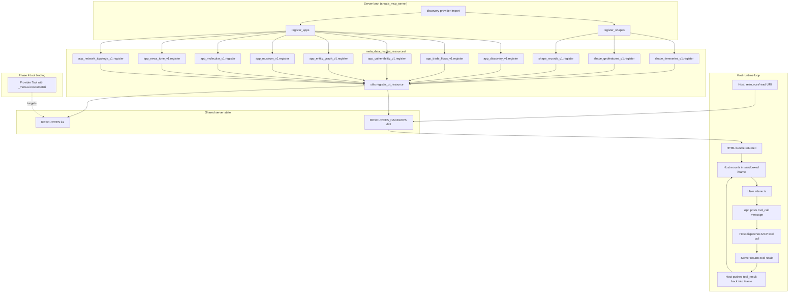

# C4-Code: UI Resources (MCP Apps)

## Overview
- **Name**: UI Resources
- **Description**: MCP Apps protocol extension — static `ui://meta-data-mcp/<class>/<name>/<version>` resources hosting HTML+JS bundles that render alongside tool results in sandboxed iframes.
- **Location**: `meta_data_mcp/ui_resources/`
- **Language**: Python 3.12+ (for registration); HTML/JS/CSS (in the bundle strings, loaded from sibling `*.html` files via `importlib.resources`)
- **Purpose**: Phase 2 + Phase 3 of the v2.0 presentation layer — shape primitives render canonical payload contracts (timeseries / geofeatures / records); apps issue outbound `tool_call` messages back to the host so a single iframe can drive a multi-tool interaction loop.

The unit ships 11 UI resources in total: 3 shape primitives and 8 apps. Every `.py` module is a thin registrar that reads its sibling `.html` bundle at import time and appends a `types.Resource` plus a handler to the shared server state.

---

## Two Resource Classes

### Shapes (passive renderers)

Shape primitives are bound by provider tools via the Phase 4 `_meta.ui.resourceUri` mechanism. They receive a payload from the host (over `postMessage`) and render it. They never issue outbound `tool_call` messages — that is the apps' job.

| URI | Payload contract | Description | File:line |
|---|---|---|---|
| `ui://meta-data-mcp/shape/timeseries/v1` | `{points: [{date, value, series?}], axes: {x, y}, annotations?}` | Plotly line chart (CDN-loaded from `cdn.plot.ly`) + profile panel (min/max/mean/stddev/gaps). ~16KB bundle. Adopters must allow `cdn.plot.ly` in `_meta.ui.csp`. | `shape_timeseries_v1.py:28` |
| `ui://meta-data-mcp/shape/geofeatures/v1` | `{features: GeoJSON FeatureCollection \| [{lat, lon, attrs}], layers?, facets?}` | Leaflet map with marker clustering. CDN-loaded. | `shape_geofeatures_v1.py:19` |
| `ui://meta-data-mcp/shape/records/v1` | `{rows: [...], schema?: {columns: [{name, type, description}]}, default_facets?: [...]}` | Dependency-free vanilla JS faceted table: per-column profile (type, null rate, distinct count, top values), free-text search, sortable columns, 50-row pagination. Schema + facets auto-inferred when absent. | `shape_records_v1.py:40` |

### Apps (interactive)

Apps are first-class interactive panels — their bundles use the host→app `tool_result` / `render` envelope on the way in and emit app→host `tool_call` envelopes on user interaction. The `tool_call` shape was invented by the Phase 3 discovery app because the MCP Apps spec hasn't ratified an app→host shape; every Phase 5 app inherits it.

| URI | Tools wrapped | Description | File:line |
|---|---|---|---|
| `ui://meta-data-mcp/app/discovery/v1` | `opendata-find-providers`, `opendata-list-domains`, `opendata-list-regions`, `opendata-list-active-providers`, `opendata-activate-provider`, `opendata-health-snapshot` | Faceted filter (domain × region × text), ranked provider list with score breakdown + live health badges, click-to-activate, bottom active-provider tray. Dependency-free. | `app_discovery_v1.py:31` |
| `ui://meta-data-mcp/app/trade-flows/v1` | `comtrade-trade-data` (UN Comtrade) | Bilateral trade Sankey (reporter → commodity → partner) + commodity treemap sized by total USD value. Accepts wrapped `{flows: [...]}` or raw `{data: [...]}` envelope; tolerates camelCase + snake_case. D3.js + d3-sankey via jsDelivr. | `app_trade_flows_v1.py:47` |
| `ui://meta-data-mcp/app/vulnerability/v1` | `nvd-search-cves`, `nvd-get-cve`, `nvd-cve-history`, `cisa-kev-list`, `cisa-kev-get`, `osv-get-vulnerability`, `osv-query-package`, `epss-scores` | Four-source synthesis (NVD + CISA KEV + FIRST EPSS + OSV.dev). Fires 4 parallel `tool_call`s on lookup; CVSS v3 radar, KEV exploitation badge, EPSS gauges, OSV affected-packages table, risk-synthesis verdict. Inline SVG, no CDN. | `app_vulnerability_v1.py:45` |
| `ui://meta-data-mcp/app/entity-graph/v1` | `openalex-*` (works/authors), `wikidata-search`, `opensanctions-*`, `crossref-works-by-author` (note: `crossref-works-search` stays on records primitive per Phase 4) | Force-directed graph across 4 providers. Each provider ships a `_to_entity_graph_payload()` adapter to a uniform `{nodes, edges}` shape. D3.js v7 via CDN; degrades to flat list on CSP block. | `app_entity_graph_v1.py:58` |
| `ui://meta-data-mcp/app/museum/v1` | `met-search`, `met-get-object` (Met Museum Open Access) | Lazy-loaded CSS-grid image browser with click-to-open provenance/artist/date/medium detail. Accepts pre-hydrated `{objects: [...]}` or raw `{objectIDs: [...]}` from `met-search`. CC0 imagery. Pure CSS grid + ``. | `app_museum_v1.py:46` |
| `ui://meta-data-mcp/app/molecular/v1` | `pubchem-compound` (PubChem small molecules), `pdb-entry` (RCSB PDB macromolecules) | 3D structure viewer. Cartoon style for chains (PDB/mmCIF), stick+sphere for ligands/small molecules. Constructs SDF/PDB download URLs on demand. 3Dmol.js (BSD-3, CDN-loaded, ~700KB). Inline adapters `adaptPdbEntry` / `adaptPubchemCompound`. Degrades gracefully when WebGL/CDN unavailable. | `app_molecular_v1.py:71` |
| `ui://meta-data-mcp/app/news-tone/v1` | `gdelt-article-search` (ArtList), `gdelt-volume-timeline` (TimelineTone) | Per-article tone lollipops on a daily-volume timeline, average-tone overlay, country co-occurrence chord (derived in-bundle from shared-day edges). Accepts raw GDELT or unified `{events, country_pairs, facets}` envelope. Inline SVG, no CDN. | `app_news_tone_v1.py:39` |
| `ui://meta-data-mcp/app/network-topology/v1` | `ripestat-asn-neighbours`, `ripestat-asn-neighbours-history`, `bgpview-asn-peers`, `bgpview-asn-upstreams`, `bgpview-asn-downstreams` (BGPView currently offline; binding kept for protocol completeness) | Force-directed BGP/ASN graph with peer/upstream/downstream edge classes. `focus_asn` pinned + bold-stroked. Click-to-expand merges new neighbours without full re-layout. D3.js v7 via jsDelivr (force layout only). | `app_network_topology_v1.py:65` |

---

## The URIS Aggregator

The package exposes a flat `URIS: dict[str, str]` mapping in `__init__.py` (lines 66–78) so callers that need to introspect the full set (tests, bundle-budget checks, future MCP-Apps lint tooling) don't have to re-walk every submodule. The aggregator was introduced in the v2.1 hygiene pass (architecture review §M1).

Keys are stable `<class>/<name>/<version>` identifiers and intentionally match the dict keys returned by `register_shapes()` and `register_apps()`. The three surfaces (URIS, register_shapes return, register_apps return) MUST stay aligned.

```python
URIS: dict[str, str] = {
    "shape/timeseries/v1":       "ui://meta-data-mcp/shape/timeseries/v1",
    "shape/geofeatures/v1":      "ui://meta-data-mcp/shape/geofeatures/v1",
    "shape/records/v1":          "ui://meta-data-mcp/shape/records/v1",
    "app/discovery/v1":          "ui://meta-data-mcp/app/discovery/v1",
    "app/trade-flows/v1":        "ui://meta-data-mcp/app/trade-flows/v1",
    "app/vulnerability/v1":      "ui://meta-data-mcp/app/vulnerability/v1",
    "app/entity-graph/v1":       "ui://meta-data-mcp/app/entity-graph/v1",
    "app/museum/v1":             "ui://meta-data-mcp/app/museum/v1",
    "app/molecular/v1":          "ui://meta-data-mcp/app/molecular/v1",
    "app/news-tone/v1":          "ui://meta-data-mcp/app/news-tone/v1",
    "app/network-topology/v1":   "ui://meta-data-mcp/app/network-topology/v1",
}
```

**Three-way alignment test**: `tests/test_ui_resources_catalog.py` pins URIS against `register_shapes()` + `register_apps()`. A half-wired addition (e.g. adding a module but forgetting to thread it into URIS, or registering it but forgetting to surface it for introspection) fails CI before merge. Adding a new shape or app means changing all three call sites in lockstep.

---

## Registration API

Two public entry points, plus a per-module `register()`:

- **`register_shapes(resources, resources_handlers) -> dict[str, str]`** (`__init__.py:81`)
  Calls `_register_timeseries / _register_geofeatures / _register_records`. Returns `{name → URI}` for advisory logging.

- **`register_apps(resources, resources_handlers) -> dict[str, str]`** (`__init__.py:101`)
  Calls each `_register_*_app`. Returns `{name → URI}`. Split from shapes deliberately because the two classes are conceptually different: shapes render passively, apps initiate outbound `tool_call`s — splitting the entry points makes it obvious which discovery-provider tools should bind to which class.

- **Per-module `register(resources, resources_handlers) -> str`**
  Every shape/app module exposes a `register()` that:
  1. Loads its sibling `.html` bundle once at import time via `importlib.resources.files(...)` (works for editable installs and packaged wheels).
  2. Calls `meta_data_mcp.utils.register_ui_resource(name=..., html=..., description=..., resources=..., resources_handlers=...)`.
  3. Returns the canonical URI string so tests can assert against it without re-declaring the constant.

Wiring: `register_shapes` + `register_apps` are called once from the discovery provider (`providers/meta_data_mcp.py`) at module import time, which itself runs during `create_mcp_server` boot.

---

## MCP Apps Wire Contract

Three load-bearing details every Phase 4 adopter and host integrator depends on:

1. **Tool → UI binding**: Tools bind to a UI resource by setting `_meta={"ui": {"resourceUri": URI}}` on `types.Tool`. The pydantic alias gotcha: the kwarg MUST be `_meta=`, not `meta=` — passing `meta=` silently fails to populate the wire field, and the host won't mount the UI.

2. **MIME type**: The resource MUST advertise MIME type `text/html;profile=mcp-app`. Without the `;profile=mcp-app` discriminator, MCP Apps-aware hosts refuse to mount the bundle as a UI resource (they fall back to rendering it as an HTML attachment, which defeats the iframe-sandbox guarantees). `register_ui_resource` in `utils.py` enforces this.

3. **Bundle weight budget**: `tests/test_ui_bundle_sizes.py` enforces a per-bundle ceiling (~100KB target for Phase 6b). CDN-loaded dependencies (Plotly, Leaflet, D3, 3Dmol.js) are documented in each bundle's HTML comment so adopters can wire `_meta.ui.csp` correctly. Dependency-free bundles (records, discovery, vulnerability, museum, news-tone) are preferred wherever a chart library isn't load-bearing.

**postMessage envelope** (host ↔ app, invented by the Phase 3 discovery app, inherited by every Phase 5 app):

```
host → app:  { type: "tool_result" | "render", id?, tool?, payload }
app → host:  { type: "tool_call",              id,  name,  arguments }
```

The MCP Apps spec has not ratified an app→host shape; the `tool_call` envelope is this repo's de-facto contract.

---

## Dependencies

**Internal**
- `meta_data_mcp.utils.register_ui_resource` — the shared registrar that constructs the `types.Resource`, sets the MIME type, and binds the handler closure that returns the HTML on `resources/read`.
- `meta_data_mcp.server.create_mcp_server` — the boot path that ends up invoking `register_shapes` + `register_apps` via the discovery provider.

**External**
- `mcp.types` — `Resource`, `Tool` (for the `_meta` binding).
- `pydantic.AnyUrl` — the handler signature type for the URI argument.
- `importlib.resources.files` — bundle loader; chosen over `__file__`-relative paths so the `.html` files are reachable from both editable and wheel installs (hatch packages them into the wheel because they sit inside the `meta_data_mcp` package tree).

**Runtime CDN dependencies (bundle-level, not Python-level)**
- `cdn.plot.ly` (timeseries shape)
- Leaflet CDN (geofeatures shape)
- `cdn.jsdelivr.net` (D3.js + d3-sankey for trade-flows, entity-graph, network-topology)
- `3dmol.org` (molecular app)

Records, discovery, vulnerability, museum, and news-tone are dependency-free.

---

## Relationships



The boot path is one-shot; the runtime loop is the steady-state interaction cycle that keeps a single iframe driving an arbitrary number of round-trip tool calls without remounting.
