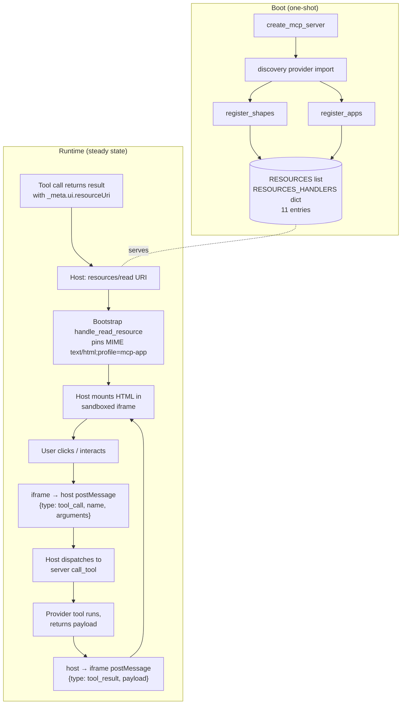

# C4-Component: MCP Apps UI Layer

## Overview
- **Name**: MCP Apps UI Layer
- **Description**: 11 static `ui://meta-data-mcp/<class>/<name>/<version>` resources implementing the MCP Apps protocol extension. Shape primitives render canonical payload contracts (timeseries / geofeatures / records); apps issue outbound `tool_call` postMessage events back to the host so a single iframe can drive a multi-tool interaction loop.
- **Type**: Library (registers resources at boot; payloads are HTML/JS strings).
- **Technology**: Python 3.12+ for registration; HTML / vanilla JS / CSS (with CDN libs for Plotly, Leaflet, D3, 3Dmol.js) in the bundle strings; MCP Apps protocol extension.

## Purpose
Tools that return JSON-over-text are something the LLM reads aloud. UI resources let the host render the same payload visually alongside the tool result, inside a sandboxed iframe, without remounting between turns. Two flavors:

- **Shape primitives** (passive). Provider tools bind a UI resource by setting `_meta={"ui": {"resourceUri": URI}}` on `types.Tool`; the host fetches the resource via `resources/read` and renders the tool's payload through it. 71 of 75 providers bind to one of the three shapes.
- **Apps** (interactive). The iframe runs code that issues outbound `tool_call` postMessage events; the host dispatches them to the server's `call_tool` handler and streams results back into the iframe. Powers the meta server's discovery panel and 7 domain-specific apps (vulnerability, museum, molecular, news-tone, entity-graph, trade-flows, network-topology).

## Software Features
- 3 shape primitives: `timeseries` (Plotly), `geofeatures` (Leaflet), `records` (dependency-free vanilla JS faceted table).
- 8 apps: `discovery`, `trade-flows`, `vulnerability`, `entity-graph`, `museum`, `molecular`, `news-tone`, `network-topology`.
- `URIS: dict[str, str]` aggregator (canonical inventory in `ui_resources/__init__.py`; pinned by `tests/test_ui_resources_catalog.py` three-way alignment test against `register_shapes()` and `register_apps()`).
- `text/html;profile=mcp-app` MIME (load-bearing — without the `;profile=mcp-app` discriminator, MCP Apps-aware hosts refuse to mount the bundle and fall back to plain HTML rendering, which defeats the iframe-sandbox guarantees).
- Bundle weight budget enforced by `tests/test_ui_bundle_sizes.py` (~100KB target per bundle); CDN-loaded deps documented in each bundle's HTML comment so adopters wire `_meta.ui.csp` correctly.
- Bundles loaded once at import time via `importlib.resources.files(...)` so `.html` siblings are reachable from both editable and wheel installs.

## Code Elements
- [c4-code-ui-resources.md](./c4-code-ui-resources.md) — all 11 resource modules in `meta_data_mcp/ui_resources/` plus the `__init__.py` aggregator, `URIS` dict, `register_shapes()`, and `register_apps()`.

## Interfaces

### MCP `resources/read`
`ui://meta-data-mcp/<class>/<name>/<version>` URIs are served with MIME `text/html;profile=mcp-app`. The bootstrap component pins this MIME at read-time via `ReadResourceContents(mime_type=...)` so the registered MIME survives the wire envelope.

### postMessage (iframe ↔ host, in-browser only)
The MCP Apps spec ratifies host → app but not app → host; this repo's de-facto contract (invented by the Phase 3 discovery app, inherited by every Phase 5 app):

```
host → app:  { type: "tool_result" | "render", id?, tool?, payload }
app → host:  { type: "tool_call",              id,  name,  arguments }
```

The host proxies `tool_call` events to the server's `call_tool` dispatch and pushes the result back into the iframe as `tool_result`.

### Python registration API
- `register_shapes(resources, resources_handlers) -> dict[str, str]` — invokes `_register_timeseries / _register_geofeatures / _register_records`; returns `{name → URI}`.
- `register_apps(resources, resources_handlers) -> dict[str, str]` — invokes each `_register_*_app`; returns `{name → URI}`. Deliberately split from shapes because the two classes are conceptually different (passive renderers vs. outbound `tool_call` emitters).
- Each module's `register(resources, resources_handlers) -> str` delegates to `meta_data_mcp.utils.register_ui_resource(name=..., html=..., description=..., resources=..., resources_handlers=...)` and returns the canonical URI string for test assertions.

Wiring: both entry points are called once from the discovery provider (`providers/meta_data_mcp.py`) at module import time, which itself runs during `create_mcp_server` boot.

## Dependencies

**Components used**
- **MCP Server Bootstrap** — provides `utils.register_ui_resource` (constructs `types.Resource`, sets MIME, binds the handler closure) and the `ReadResourceContents(mime_type=...)` MIME-pinning fix in `handle_read_resource`. Boot path `create_mcp_server` invokes `register_shapes` + `register_apps` transitively via discovery provider import.

**External Python**
- `mcp.types` — `Resource`, `Tool` (`_meta` binding lives on `types.Tool`).
- `pydantic.AnyUrl` — handler signature type for the URI argument.
- `importlib.resources.files` — bundle loader; chosen over `__file__`-relative paths so hatch-packaged wheels stay valid.

**Runtime CDN dependencies (bundle-level, not Python-level)**
- `cdn.plot.ly` — timeseries shape.
- Leaflet CDN — geofeatures shape.
- `cdn.jsdelivr.net` — D3.js + d3-sankey for trade-flows, entity-graph, network-topology.
- `3dmol.org` — molecular app (~700KB, BSD-3).
- Records, discovery, vulnerability, museum, and news-tone are dependency-free.

## Wire Contract Gotchas

1. **`_meta=` constructor kwarg, not `meta=`** on `types.Tool`. `populate_by_name` is `False` on the SDK's pydantic model, so passing `meta=` silently drops the value into model extras and never reaches the wire envelope. Result: the host has no idea the tool wants a UI bound and the iframe never mounts. Always pass `_meta={"ui": {"resourceUri": URI}}`.
2. **`;profile=mcp-app` MIME parameter required**. MCP Apps-aware hosts gate on the discriminator; without it they fall back to HTML-attachment rendering and the iframe sandbox guarantees are lost. `utils.register_ui_resource` enforces this; the bootstrap's `_mime_by_uri` lookup keeps it intact at read-time.
3. **Bundle weight CI gate**. `tests/test_ui_bundle_sizes.py` enforces a per-bundle ceiling. Inline-SVG / dependency-free bundles (records, discovery, vulnerability, museum, news-tone) are preferred wherever a chart library isn't load-bearing.
4. **Three-way URIS alignment**. `URIS` dict, `register_shapes()` return, and `register_apps()` return MUST stay aligned; `tests/test_ui_resources_catalog.py` fails the build if you wire a new module but forget to surface it in `URIS` (or vice versa).

## Component Diagram



The boot path is one-shot; the runtime loop is the steady-state interaction cycle that keeps a single iframe driving an arbitrary number of round-trip tool calls without remounting.
