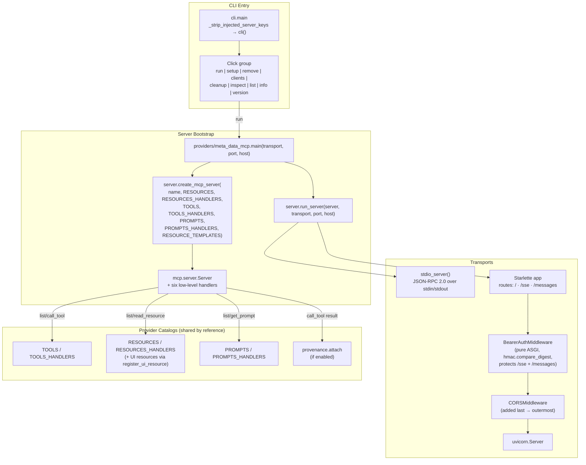

# C4-Component: MCP Server Bootstrap

## Overview
- **Name**: MCP Server Bootstrap
- **Description**: The runtime container's entrypoint that parses CLI args, assembles an `mcp.server.Server` from provider catalogs, connects a stdio or SSE transport (with optional bearer-auth + CORS middleware), and runs the MCP protocol loop.
- **Type**: Application (process entrypoint)
- **Technology**: Python 3.12+, MCP SDK low-level Server, Click CLI, Starlette/Uvicorn (SSE), `mcp.server.stdio` (stdio)

## Purpose
- Owns process startup: parse args → build server → connect transport → run forever.
- Wires the SDK's six low-level handlers (`list_resources`, `read_resource`, `list_tools`, `call_tool`, `list_prompts`, `get_prompt`) — plus `list_resource_templates` — to the meta server's `TOOLS` / `TOOLS_HANDLERS` / `RESOURCES` / `RESOURCES_HANDLERS` dicts by reference, so post-bootstrap mutations by providers are served live.
- Owns the SSE security perimeter: `BearerAuthMiddleware` (pure ASGI to avoid buffering streams), `CORSMiddleware` (outermost so OPTIONS preflights survive), optional bearer token via `META_DATA_MCP_AUTH_TOKEN`, constant-time comparison via `hmac.compare_digest`.
- Pins resource MIME at read-time via `ReadResourceContents(mime_type=...)` so the registered MIME (e.g. `text/html;profile=mcp-app` for UI resources) survives the wire envelope.
- Provides a Click-based CLI for the full lifecycle: install/remove the server in any of six supported MCP clients (Claude Desktop, Claude Code, Cursor, Windsurf, Gemini, LM Studio), inspect with the official MCP Inspector, run, and introspect plugins.

## Software Features
- **stdio transport** — for Claude Desktop, Claude Code, and MCP Inspector (line-delimited JSON-RPC 2.0).
- **SSE transport** — Starlette + Uvicorn app with `/`, `/sse`, `/messages` routes for remote/web clients.
- **Bearer token auth on SSE** — optional; when `META_DATA_MCP_AUTH_TOKEN` is set, protected prefixes (`/sse`, `/messages`) require `Authorization: Bearer <token>`. Unset → unauth + startup warning.
- **CORS** — added last so it is the outermost middleware; OPTIONS preflights return CORS headers before the bearer check fires.
- **Resource MIME pinning** — `handle_read_resource` wraps payloads in `ReadResourceContents(content=..., mime_type=...)` using a `_mime_by_uri` lookup built once at bootstrap.
- **CLI commands** — `setup`, `remove`, `cleanup`, `inspect`, `run`, `version`, `list`, `info`, `clients`.
- **Multi-client setup** — auto-detects installed clients and writes the canonical `mcpServers` entry; `--print-json` emits both stdio and remote-SSE snippets without touching files.
- **Legacy migration** — `_migrate_legacy_entries` strips `opendata-mcp-*` keys (including the two double-prefixed mistakes) on every write.
- **Defensive key-stripping shim** — `_strip_injected_server_keys` cleans Claude Desktop's habit of appending the server's own `mcpServers` key onto `sys.argv` on restart; wrapped in `except Exception: pass` so a parser hiccup never blocks startup.
- **Provenance hook** — `handle_call_tool` calls `provenance.attach(result, tool_name=name, arguments=arguments)` when `provenance.is_enabled()`, so every tool result inherits a provenance envelope without provider code knowing.

## Code Elements
- [c4-code-server-bootstrap.md](./c4-code-server-bootstrap.md) — `server.py`, `cli.py`, `utils.py`, `__init__.py`.

## Interfaces

### JSON-RPC over stdio
The canonical MCP transport. Line-delimited JSON-RPC 2.0 over the child process's stdin/stdout via `mcp.server.stdio.stdio_server()`. Operations:
- `resources/list` → `handle_list_resources`
- `resources/read` → `handle_read_resource` (returns `ReadResourceContents` with pinned MIME)
- `resources/templates/list` → `handle_list_resource_templates`
- `tools/list` → `handle_list_tools`
- `tools/call` → `handle_call_tool` (provenance-decorated)
- `prompts/list` → `handle_list_prompts`
- `prompts/get` → `handle_get_prompt`

### JSON-RPC over SSE
Server-Sent Events for remote/web clients. Operations:
- `GET /` — unauthenticated health/root endpoint.
- `GET /sse` — long-lived SSE stream of JSON-RPC responses + server-initiated events; protected when token is set.
- `POST /messages` — client-to-server JSON-RPC requests; protected when token is set.
- All seven MCP operations above are reachable through this stream/POST pair.

### CLI (`meta-data-mcp` binary)
Click commands:
- `run --transport stdio|sse --port --host` — starts the server (calls `anyio.run(server_module.main, ...)`).
- `setup --local --force --print-json --client <KEY|all>` — installs into one or all detected clients.
- `remove --client <KEY|all>` — uninstalls.
- `clients` — lists supported clients with per-client status (configured / installed / not detected / unsupported on this OS).
- `cleanup --apply` — dry-run by default; strips legacy `opendata-mcp-*` keys from Claude Desktop config.
- `inspect` — wraps the official MCP Inspector around the stdio server.
- `list` — enumerates provider plugins.
- `info [--plugin <name>]` — prints the meta-server overview or a plugin's docstring.
- `version` — prints `__version__`.

## Dependencies

### Internal components used (via shared catalogs)
- **Discovery Engine** — populates `TOOLS` / `TOOLS_HANDLERS` lazily; bootstrap captures them by reference so mutations are served live.
- **MCP Apps UI Layer** — registers UI resources via `register_ui_resource`, which mutates `RESOURCES` + `RESOURCES_HANDLERS` in place.
- **Output Pipeline** — invoked downstream of `handle_call_tool` via the registered tool handlers.
- **Provenance Layer** — `handle_call_tool` calls `provenance.attach(...)` when enabled.

### External
- `mcp` — `mcp.server.Server`, `mcp.server.stdio.stdio_server`, `mcp.server.sse.SseServerTransport`, `mcp.types`, `mcp.server.lowlevel.helper_types.ReadResourceContents`.
- `starlette` — `Starlette`, `Route`, `Mount`, `CORSMiddleware`, `JSONResponse`.
- `uvicorn` — `Config`, `Server`.
- `click` — CLI framework.
- `anyio` — `anyio.run` to launch the async main.
- `pydantic` — `AnyUrl`.
- Standard library: `hmac`, `os`, `logging`, `pathlib`, `dataclasses`, `pkgutil`, `importlib`, `subprocess`, `shutil`, `json`, `sys`, `platform`, `traceback`, `time`.

## Component Diagram

