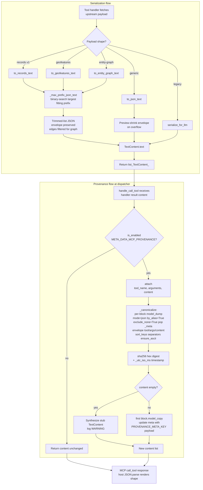

# C4-Component: Output Pipeline

## Overview
- **Name**: Output Pipeline
- **Description**: Size-bounded JSON serializers (MAX_RESPONSE_CHARS budget) for the four canonical response shapes, shared Pydantic field types for arguments, and optional sha256+timestamp provenance metadata on every tool result.
- **Type**: Library
- **Technology**: Python 3.12+, Pydantic, stdlib (`json`, `hashlib`, `datetime`)

## Purpose
Two distinct concerns are bundled here because both shape outgoing `TextContent`:

1. **Serialization** — LLM context windows are finite. Raw upstream JSON would blow the context budget. The pipeline applies a binary-search prefix-trim per shape (records → trim rows, geofeatures → trim features, entity-graph → trim nodes + drop orphan edges, generic → preview-shrink envelope) to fit `MAX_RESPONSE_CHARS`. Every code path returns valid JSON within budget — host bundles that `JSON.parse` always render something rather than failing to a blank surface.

2. **Provenance** — optional sha256 + ISO 8601 millisecond UTC timestamp wrapping every successful `call_tool` result, attached to the first content block's `_meta` field under the `meta-data-mcp/provenance` key. Opt-in via the `META_DATA_MCP_PROVENANCE` env var. The digest binds `(tool_name, arguments, content)` so an audit log can distinguish "tool A returned X" from "tool B returned X", and detect content tampering or wrong-input mismatches.

## Software Features

### Serialization
- `MAX_RESPONSE_CHARS = 20_000` — default character budget for every tool/resource text response.
- `serialize_for_llm(data)` — legacy generic serializer (mid-string slice; may produce invalid JSON). Kept for tools that don't bind to an MCP Apps shape.
- `to_json_text(payload, max_chars=None)` — generic shape-agnostic serializer that always returns valid JSON. On overflow, replaces the payload with `{"truncated": true, "original_length": N, "max_chars": M, "preview": "..."}` and shrinks `preview` character-by-character until it fits. Fallbacks: `{"truncated": true}` then `{}`.
- `to_records_text(payload, max_chars)` — shape-bound serializer for `ui://meta-data-mcp/shape/records/v1`. Trims `rows`; preserves `schema` / `default_facets`.
- `to_geofeatures_text(payload, max_chars)` — handles both option B (`{"features": [...]}`) and option A native GeoJSON (`{"features": {"type": "FeatureCollection", "features": [...]}}`); trims the inner list, preserves FeatureCollection wrapper.
- `to_entity_graph_text(payload, max_chars)` — for `entity-graph` / `network-topology` envelopes. Trims `nodes` to largest fitting prefix, then drops any `edges` whose `source` or `target` references a dropped node id so the graph stays internally consistent.
- `_max_prefix_json_text(items, build_payload, max_chars)` — shared binary-search engine for the largest list prefix whose serialized form fits.
- `_json_dumps(payload)` — internal canonical dump: `ensure_ascii=False`, `default=str`, `sort_keys=True`, `separators=(",", ":")`. Byte-stable across Python runs — important because this is also the envelope hashed by provenance.

### Fields
Four Pydantic field aliases consumed by provider parameter models:
- `NonEmptyStr` — `Annotated[str, Field(min_length=1)]`
- `Slug` — `Annotated[str, Field(pattern=r"^[a-z0-9-]+$", min_length=1)]`
- `PageInt` — `Annotated[int, Field(default=1, ge=1)]`
- `PageSize` — `Annotated[int, Field(default=20, ge=1, le=1000)]`

### Provenance
- `is_enabled()` — `os.getenv("META_DATA_MCP_PROVENANCE", "").strip().lower() in {"1","true","yes","on"}`. Case-insensitive truthy parsing; unset/empty/anything else is falsy.
- `attach(content, *, tool_name, arguments)` — returns a fresh content list with provenance on the first block. Inputs not mutated; first block rebuilt via `model_copy(update={"meta": merged_meta})`, preserving any pre-existing `_meta` keys. `tool_name` and `arguments` are keyword-only so callers cannot accidentally compute an output-only digest that loses input-output binding.
- `_canonicalize(tool, args, content)` — load-bearing kwargs that form the public verification contract:
  - Per-block: `model_dump(mode="json", by_alias=True, exclude_none=True)`, then pop `_meta`.
  - Envelope: `{"tool": tool_name, "arguments": arguments or {}, "content": rendered}` (None normalized to `{}` so no-args and empty-args calls hash identically).
  - Top-level: `json.dumps(..., sort_keys=True, separators=(",", ":"), ensure_ascii=True).encode("utf-8")`.
  - Digest is lowercase hex sha256 of those bytes.
- `_utc_iso_ms()` — ISO 8601 UTC with millisecond precision and trailing `Z` (e.g. `2026-05-17T14:23:08.041Z`). Timestamp is sibling metadata, **not** part of the hashed envelope.
- `PROVENANCE_META_KEY = "meta-data-mcp/provenance"` — public constant; receivers use it to locate the payload.
- Logs `WARNING` when a tool returns empty content and synthesizes a stub `TextContent(text="")` so the fingerprint has somewhere to live.
- Receiver verification recipe documented in module docstring (and reproduced in [c4-code-provenance.md](./c4-code-provenance.md)).

## Code Elements
- [c4-code-serialization.md](./c4-code-serialization.md) — `meta_data_mcp/serialize.py`, `meta_data_mcp/fields.py`
- [c4-code-provenance.md](./c4-code-provenance.md) — `meta_data_mcp/provenance.py`

## Interfaces

### Python API for plugin authors
```python
from meta_data_mcp.serialize import (
    serialize_for_llm,
    to_json_text,
    to_records_text,
    to_geofeatures_text,
    to_entity_graph_text,
)
# Call after fetching upstream data; return result as:
#   [TextContent(type="text", text=serialized)]

from meta_data_mcp.fields import NonEmptyStr, Slug, PageInt, PageSize
# Use in Pydantic parameter models to standardize argument constraints.
```

### Dispatch-time wrap (transparent to plugins)
`meta_data_mcp.server.create_mcp_server`'s `handle_call_tool` checks `provenance.is_enabled()` once, then calls `provenance.attach(result, tool_name=name, arguments=arguments)` on every handler return. Plugin authors never invoke `attach` directly — the flip applies uniformly to meta tools, plugin tools, and any future tools without per-handler wiring.

## Dependencies
- **Components used**: none (leaf component; used by Provider Plugins and the dispatcher).
- **External**: `pydantic`, stdlib (`json`, `hashlib`, `datetime`, `os`, `logging`, `typing`), `mcp` package (SDK content-block Pydantic models).

## Component Diagram



## Notes
- The `utils.py` split (v2.1 hygiene, commit `c0376d3`) made `serialize.py` and `provenance.py` standalone modules; `meta_data_mcp.utils` re-exports public symbols for legacy callers.
- `_json_dumps` (serialization) and `_canonicalize` (provenance) share the principle that every dump kwarg is load-bearing for byte-stability. The serializer's deterministic output is what makes the provenance digest reproducible by a receiver following the documented contract.
- Provenance default is OFF — zero per-call cost. Callers opt in only when they need tamper-evidence or an audit trail.
