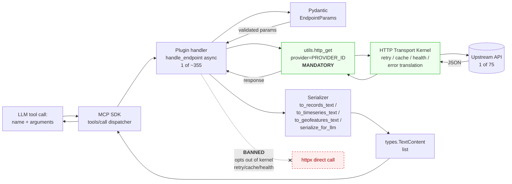

# C4-Component: Provider Plugin Catalog

## Overview

- **Name**: Provider Plugin Catalog
- **Description**: 75 lazy-activated plugin modules exposing ~355 MCP tools across upstream open-data APIs, all conforming to one declarative contract
- **Type**: Library (dynamically imported)
- **Technology**: Python 3.12+, MCP SDK Tool model, Pydantic input schemas

## Purpose

The data plane. The Discovery Engine answers *"which providers should I use"*; this component **executes the actual fetches**. Lazy import means a fresh server boots advertising only ~11 meta tools — plugins activate on demand to keep the `tools/list` catalog manageable for the LLM. Once activated, each plugin's tools join the live catalog and dispatch directly to the upstream API through the shared HTTP kernel.

Every plugin is a thin translator between an upstream HTTP API and the MCP `TextContent` protocol — no business logic, no shared state, no per-plugin startup cost. The uniform contract is what makes auto-generation (`tools/generate_provider.py`) tractable and what lets the discovery loader merge any plugin into the live server with a single introspection pass.

## Software Features

- **The Plugin Contract** — each module exposes a fixed module-level surface:
  - **Required**: `PROVIDER_ID` (canonical id, matches `registry.py:ProviderEntry.server_name`), `BASE_URL`, `TOOLS` (list of `mcp.types.Tool`), `TOOLS_HANDLERS` (tool-name → async handler)
  - **Optional**: `RESOURCES`, `RESOURCES_HANDLERS`, `main(transport, port, host)` for standalone-server fallback
- **75 providers** organized by domain (see Categorized Provider Table below) — domain memberships are defined in `registry.py:DOMAINS`
- **Four canonical response shapes**:
  - **records** — CKAN-style faceted tables (`shape/records/v1`)
  - **timeseries** — World Bank-style indicator series (`shape/timeseries/v1`)
  - **geofeatures** — OSM-style GeoJSON-flavoured feature collections (`shape/geofeatures/v1`)
  - **custom** — provider-specific app UIs (e.g. NVD vulnerability app)
- **71 of 75 plugins** bind to a `ui_resources/shape_*` URI for host-side rendering via `_meta={"ui": {"resourceUri": ...}}` on the `Tool`
- **Pydantic-validated arguments** per handler; `ValidationError` surfaces raw so callers can branch on it vs. `ProviderError`
- **Size-bounded serialization** — every payload flows through `to_records_text` / `to_timeseries_text` / `to_geofeatures_text` / `serialize_for_llm` so responses fit the LLM context window
- **Lazy activation** — plugins are not imported at server startup; activation happens on demand via `opendata-activate-provider` (or eagerly via `META_DATA_MCP_PRELOAD`)

## Categorized Provider Table

The 75 plugins span 30 controlled-vocabulary domains. Counts below are domain memberships, so multi-domain providers (e.g. `global_faostat` is `agriculture` + `statistics` + `environment`) are counted in each. Sorted by population:

| Category | Count | Representative providers |
|---|---|---|
| Government / open-data portals | 18 | `us_data_gov`, `uk_gov`, `fr_data_gouv` |
| Official statistics | 10 | `eu_eurostat`, `global_world_bank`, `global_oecd` |
| Health / biomedical | 8 | `us_fda_openfda`, `global_who_gho`, `global_europepmc` |
| Scholarly / research | 6 | `global_arxiv`, `global_crossref`, `global_openalex` |
| Finance / economics | 6+6 | `eu_ecb`, `us_sec_edgar`, `global_frankfurter` |
| Earth-science / environment / weather | 6+5+4 | `eu_copernicus`, `us_noaa_ncei`, `global_open_meteo` |
| Security / vulnerability | 5 | `global_nvd_cve`, `us_cisa_kev`, `global_osv_dev` |
| Geo / geocoding / culture | 5+2+3 | `global_overpass`, `global_osm_nominatim`, `global_met_museum` |
| Legal | 4 | `uk_legislation`, `us_courtlistener`, `nl_rechtspraak` |
| Knowledge / encyclopedic | 4 | `global_wikidata`, `global_wikipedia`, `global_open_library` |
| Transit / aviation / space | 3+3+1 | `ch_sbb`, `global_opensky`, `us_nasa` |
| Biology / biodiversity / chemistry | 2+2+1 | `global_gbif`, `global_inaturalist`, `global_pubchem` |
| Networking | 2 | `global_bgpview`, `global_ripe_stat` |
| Specialty city portals (Socrata/ArcGIS) | — | `us_raleigh`, `us_cary`, `us_nc_onemap` |
| Trade / agriculture / news / crypto | 1 each | `global_un_comtrade`, `global_faostat`, `global_coingecko` |

**Telling distribution stats**: of the 75 plugins, **71 import a `ui_resources.shape_*` URI** (bind tool output to a host-rendered UI shape), and **36 use a typed `to_*_text()` serializer**. The remainder use the generic `serialize_for_llm` JSON formatter.

## Code Elements

- [c4-code-provider-plugins.md](./c4-code-provider-plugins.md) — the plugin contract in detail, the `__template__.py` scaffold, four representative implementations (records / timeseries / geofeatures / custom), and the categorized inventory

## Interfaces

- **MCP tools** — each plugin contributes 1-N tools to the catalog when activated. Tool names are namespaced by convention (e.g. `world-bank-list-countries`, `nvd-search-cves`, `overpass-around-amenity`). Across the 75 plugins, ~355 tools become advertisable. Each tool carries:
  - `name`, `description`
  - `inputSchema` from a Pydantic `model_json_schema()`
  - optional `_meta={"ui": {"resourceUri": ...}}` for MCP Apps UI binding
- **Plugin contract** — the module-level surface the activation loader inspects via `getattr`:
  - At minimum: `PROVIDER_ID`, `BASE_URL`, `TOOLS`, `TOOLS_HANDLERS`
  - Optional extensions: `RESOURCES`, `RESOURCES_HANDLERS`, `main()`
  - The loader skips any `Tool` whose name is missing from `TOOLS_HANDLERS` (logs a warning)
- **Handler signature** — every tool handler is an async function returning `Sequence[types.TextContent]`:
  ```python
  async def handle_<endpoint>(arguments: dict[str, Any] | None = None) -> Sequence[types.TextContent]
  ```

## Dependencies

**Internal components used:**
- **HTTP Transport Kernel** — every plugin calls `http_get(provider=PROVIDER_ID)` (or `http_post`). This kwarg unlocks retry-on-429/5xx, partitioned response caching, health-registry feedback, and URL-redacted `ProviderError` translation. Direct `httpx.get` is a **regression** — every kernel guarantee opts out with it.
- **Output Pipeline (Serialization)** — `to_records_text`, `to_timeseries_text`, `to_geofeatures_text`, `to_json_text`, `serialize_for_llm` — all size-bounded so payloads fit the LLM context window.
- **MCP Apps UI Layer** — `ui_resources.shape_records_v1.URI`, `shape_timeseries_v1.URI`, `shape_geofeatures_v1.URI`, plus provider-specific app URIs (e.g. `app_vulnerability_v1.URI`).
- **`meta_data_mcp.fields`** — typed Pydantic field aliases like `NonEmptyStr`.
- **`meta_data_mcp.errors`** — `ProviderError` (plugins rarely import directly; `http_get` raises it).
- **Discovery Engine** — loader introspects the plugin surface at activation time; not a runtime dependency of the handler itself.

**External systems**: 75 distinct upstream open-data APIs (World Bank, NVD, OSM Overpass, Crossref, OpenAlex, ECB, NOAA, FDA, …). HTTP only — no bundled datasets, no on-disk caches, no DB clients, no per-API SDKs.

**External libraries**: `mcp.types` (SDK types), `pydantic` (input validation).

## Component Diagram



**Boundary rules visible in the diagram:**
1. `provider=PROVIDER_ID` is mandatory on every kernel call — it routes per-provider retry/cache/health.
2. Direct `httpx` from a handler is the **banned boundary** (red dashed). It bypasses every kernel guarantee.
3. Handlers always return `list[TextContent]` — never raw JSON, never `dict`.
4. Pydantic `ValidationError` propagates raw (not caught-and-wrapped) so callers can branch on it vs. `ProviderError`.

## Notes

- **No persistent state per provider** — handlers are pure functions over `(arguments, upstream HTTP)`. All cross-cutting concerns live in the transport kernel. ADR-0001 codifies this no-state invariant for v2.x.
- **Tool-name collision handling** — `_merge_plugin` in `discovery/loader.py` detects duplicates across providers, logs a warning, and the first registrant owns the name.
- **`__template__.py` is the scaffold** — never loaded; explicitly listed in `_NON_PLUGIN_MODULES` alongside `meta_data_mcp` (the meta server) and the legacy `meta_data_mcp_all` aggregator.
- **Auto-generation pipeline** — many newer providers (e.g. `global_nvd_cve.py`) are produced by `tools/generate_provider.py` from a YAML spec. The template-shaped surface is what makes auto-generation tractable.
- **Standalone-server fallback** — each plugin's optional `main()` lets it run independently via `python -m meta_data_mcp.providers.<name>`. The meta server doesn't invoke this; it's a development affordance.
