# C4-Component: Plugin Generator & Release Tooling

## Overview
- **Name**: Plugin Generator & Release Tooling
- **Description**: Design-time offline tools — declarative YAML provider specs (17 in `tools/specs/`) scaffold provider modules conforming to the kernel's plugin contract; scripts handle version bumps, PR merge gates, and systemd install.
- **Type**: CLI Tools (not deployed; not imported by the runtime)
- **Technology**: Python 3.12+, PyYAML, Bash, systemd

## Purpose
Reduce per-provider implementation cost. Most providers are generated from a ~30-line YAML spec rather than hand-written. Release plumbing (`bump_version.py`, `pr_check.sh`) codifies the version-tag-publish flow so that humans cannot skip a step. Ops plumbing (`install-systemd-service.sh`) codifies the production install.

## Software Features
- `tools/generate_provider.py` — YAML spec → `meta_data_mcp/providers/<id>.py` + `tests/providers/test_<id>.py` stub
- `tools/specs/*.yaml` — 17 declarative provider specs; schema includes `id`, `server_name`, `description`, `base_url`, `tools[]`, optional `response_shape`, `requires_env`, and discovery metadata (`domains`, `regions`, `keywords`)
- **Phase 6a MCP Apps wiring** — when `response_shape: timeseries|geofeatures|records` is set, the generator emits the matching shape serializer call plus `_meta.ui.resourceUri` binding on the `Tool(...)` registration
- **No-Jinja2 template** — direct f-string rendering helpers (`_render_field`, `_render_params_class`, `_render_fetch_fn`, `_render_handler`, `_render_registration`) keep the dependency surface minimal and the generated diff trivially auditable
- **Refuses to overwrite without `--force`** — hand-edits made after generation (custom adapters, auth helpers) are preserved
- `scripts/bump_version.py` — `major|minor|patch` → version bump → commit → tag → push → `gh release create` (release event triggers `release.yml` PyPI publish)
- `scripts/pr_check.sh` — 7-step merge gate (CI green, comments resolved, etc.) exposed as `make pr-check N=<num>`; exits non-zero on the first failure
- `scripts/install-systemd-service.sh` — production install with service user, bearer token, systemd unit; re-runnable with `.bak` backups

## Code Elements
- [c4-code-tooling.md](./c4-code-tooling.md) — full inventory of `tools/` and `scripts/`, including the generator's public API, spec schema, and per-script invocation details.

## Interfaces
- **CLI**:
  - `uv run python tools/generate_provider.py tools/specs/<name>.yaml [--dry-run] [--force]` → writes a new provider module + test stub
  - `uv run python scripts/bump_version.py {major|minor|patch}` → bump + commit + tag + push + GitHub release
  - `make pr-check N=<pr-number>` → wraps `scripts/pr_check.sh`
  - `sudo scripts/install-systemd-service.sh [--start]` → installs as a systemd service on a production host

## Dependencies
- **Components used**: none at runtime (the generator imports nothing from `meta_data_mcp.*`). Outputs become Provider Plugins loaded by the kernel at runtime.
- **External**: `pyyaml` (generator only), GitHub CLI (`gh`), `jq`, `uv`, `git`, `systemd`/`systemctl` (install script only)

## Notes
- These tools are **NOT shipped in the runtime container** — they exist for plugin authors and release engineers at design time.
- The release workflow (`.github/workflows/release.yml`) is triggered by the tag push that `bump_version.py` performs; it runs `uv build`, verifies `__version__` matches the tag, uploads to the GitHub Release, and publishes to PyPI via trusted publishing.
- `pr_check.sh` codifies the architecture-review §M1 lint gate plus the seven-step merge checklist in `docs/PR_MERGE_CHECKLIST.md`.
- `response_shape` mappings (SDMX vs JSON-stat vs native) are too provider-specific to auto-generate, so the generator emits a `TODO` for the response→shape adapter — the author writes only the adapter; the rest of the wiring is mechanical.

## Component Diagram

```mermaid
flowchart LR
    subgraph authoring["Plugin author (design time)"]
        AUTHOR["Author"]
        YAML["tools/specs/&lt;name&gt;.yaml<br/>(~30 lines, declarative)"]
        GEN["tools/generate_provider.py"]
        PROV["meta_data_mcp/providers/&lt;id&gt;.py"]
        STUB["tests/providers/test_&lt;id&gt;.py"]
        AUTHOR -->|writes| YAML
        YAML -->|"uv run generate_provider.py"| GEN
        GEN -->|emits| PROV
        GEN -->|emits| STUB
    end

    subgraph ci["CI / merge gate"]
        COMMIT["developer commits + opens PR"]
        PRCHECK["scripts/pr_check.sh<br/>(make pr-check N=&lt;n&gt;)"]
        MERGE["PR merged to main"]
        PROV -->|committed| COMMIT
        STUB -->|committed| COMMIT
        COMMIT --> PRCHECK
        PRCHECK -->|7-step gate passes| MERGE
    end

    subgraph release["Releaser"]
        RELEASER["Release engineer"]
        BUMP["scripts/bump_version.py<br/>{major|minor|patch}"]
        TAG["git tag vX.Y.Z + push"]
        WORKFLOW[".github/workflows/release.yml"]
        PYPI["PyPI + GitHub Release"]
        MERGE --> RELEASER
        RELEASER -->|runs| BUMP
        BUMP --> TAG
        TAG -->|triggers| WORKFLOW
        WORKFLOW -->|uv build + publish| PYPI
    end

    subgraph ops["Ops / production install"]
        OPERATOR["Operator"]
        INSTALL["scripts/install-systemd-service.sh"]
        UNIT["systemd unit:<br/>meta-data-mcp.service"]
        SERVER["Production host<br/>(mcp service user, bearer token)"]
        OPERATOR -->|sudo bash| INSTALL
        PYPI -->|uv pip install| INSTALL
        INSTALL --> UNIT
        UNIT --> SERVER
    end
```

