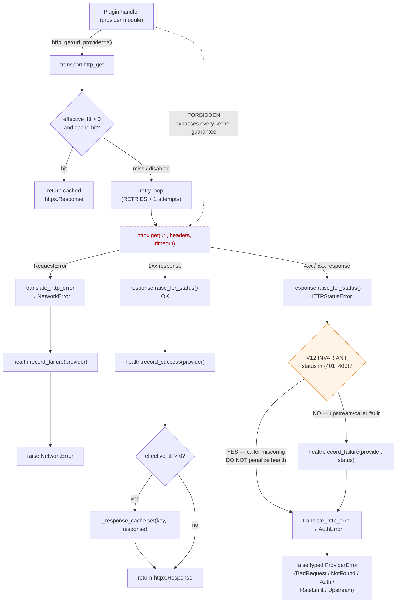

# C4-Component: HTTP Transport Kernel

## Overview
- **Name**: HTTP Transport Kernel
- **Description**: Mandatory `http_get` / `http_post` chokepoint with TTL cache (256 entries, monotonic clock, auth-partitioned keys), exponential-decay health tracking (τ=300s), and uniform error translation across all 75 provider plugins
- **Type**: Library (used in-process)
- **Technology**: Python 3.12+, `httpx` (the only place `httpx` is allowed), stdlib

## Purpose
Plugins are forbidden from calling `httpx` directly. Routing every outbound HTTP through this kernel buys five things uniformly:

1. **Cache reuse** — same request inside TTL returns cached response, with auth-partitioned keys so authenticated and anonymous traffic never share entries.
2. **Health tracking** — `HealthScorer` accumulates exponential-decay success/failure mass per provider (τ=300s ⇒ ~5min characteristic).
3. **Error normalization** — HTTP status codes are translated into a typed `ProviderError` hierarchy with URL-redacted messages safe to return to callers.
4. **The V12 invariant** — 401/403 do **NOT** penalize the provider's health (caller misconfig is not upstream fault); pinned by `tests/test_health.py::test_record_failure_skipped_for_401_403`.
5. **Auth-aware cache partitioning** — `_cache_key` hashes a `has_auth` flag so cached responses cannot leak across auth contexts.

## Software Features
- `http_get(url, *, provider, params=None, headers=None, timeout=10.0, cache_ttl=None)` — the mandatory contract.
- `http_post(url, *, provider, json=None, ...)` — POST variant, intentionally **not** cached (POST is non-idempotent in the general case).
- `_TTLCache` — 256-entry max, oldest-insertion eviction, monotonic clock, thread-safe under `threading.Lock`.
- `ProviderError` hierarchy with `kind`, `retryable`, `status`, redacted `__str__`, and `__cause__` chaining.
- `HealthScorer.health_score(provider_id) -> float` in `[0.0, 1.0]`, consumed by Discovery Engine routing and the `opendata-health-snapshot` meta tool.
- `translate_http_error(provider, exc) -> ProviderError` — central status → typed-error mapping, free of raw URLs.
- `ProviderConfig` (frozen dataclass) for per-provider tuning: `base_url`, `auth_env_var`, `contact_required`, `default_accept`, `rate_limit_per_minute`.
- Retry/backoff: `OPENDATA_MCP_HTTP_RETRIES + 1` attempts, RFC 7231 `Retry-After` honored (capped 30s), exponential `0.5 * 2^attempt` capped at 8s.
- User-Agent identification with optional `OPENDATA_MCP_CONTACT` env var (required by Crossref, Europe PMC, OSM Nominatim, SEC EDGAR).

## Code Elements
- [c4-code-transport-kernel.md](./c4-code-transport-kernel.md) — `transport.py`, `errors.py`, `health.py`, `provider_config.py`, `client.py`

## Interfaces

**Python API** (internal-only — providers import these):

| Symbol | Purpose |
|---|---|
| `meta_data_mcp.transport.http_get(url, *, provider, ...)` | Mandatory GET chokepoint with cache + health + error translation |
| `meta_data_mcp.transport.http_post(url, *, provider, ...)` | Mandatory POST chokepoint (no cache by design) |
| `meta_data_mcp.health.health_score(provider_id) -> float` | Read provider health in `[0.0, 1.0]` (routing input) |
| `meta_data_mcp.health.snapshot(provider_ids=None)` | Instrumentation snapshot consumed by `opendata-health-snapshot` |
| `meta_data_mcp.errors.translate_http_error(provider, exc)` | Central status → typed `ProviderError` mapping |
| `meta_data_mcp.errors.ProviderError` (+ subclasses) | Typed exception hierarchy |
| `meta_data_mcp.provider_config.ProviderConfig` | Per-provider config bundle (advisory today) |

`meta_data_mcp.utils` re-exports the public surface so legacy call sites continue to import the same names (v2.1 hygiene pass §H1).

## Dependencies
- **Components used**: none — this is a leaf component; every plugin and meta-tool depends on it.
- **Consumers**: every provider plugin (75+), Discovery Engine routing (via `health_score`), `opendata-health-snapshot` meta tool (via `snapshot`).
- **External**: `httpx` (synchronous client — the only place it is allowed), Python stdlib (`hashlib`, `json`, `logging`, `os`, `threading`, `time`, `datetime`, `email.utils.parsedate_to_datetime`, `dataclasses`, `math.exp`, `typing`).

## Component Diagram

### Error-path summary

| HTTP source | Typed error | `retryable` | Penalizes health? |
|---|---|---|---|
| 400 / 422 | `BadRequestError` | no | yes |
| 404 | `NotFoundError` | no | yes |
| **401 / 403** | **`AuthError`** | **no** | **NO — V12 invariant** |
| 429 | `RateLimitError` (carries `retry_after`) | yes | yes (only if retries exhausted) |
| 5xx | `UpstreamError` | yes | yes (only if retries exhausted) |
| `httpx.RequestError` | `NetworkError` | yes | yes (only if retries exhausted) |
| other | `ProviderError` (base) | no | yes |

### Key invariants (pinned by code + tests)

1. **`provider=` is mandatory** on `http_get` / `http_post`. No anonymous path. (`transport.py` lines 182-184.)
2. **URL-redacted errors**: `translate_http_error` output is safe to return to callers — no raw URLs, params, or credentials. (`errors.py` lines 9-13.)
3. **V12 401/403 skip**: auth failures never penalize provider health. Pinned by `tests/test_health.py::test_record_failure_skipped_for_401_403`. (`transport.py` lines 315-321.)
4. **Auth-partitioned cache keys**: `_cache_key` hashes `has_auth`; authenticated and anonymous responses never share an entry. (`transport.py` lines 195-197.)
5. **POST is never cached**: non-idempotent by spec; caching would be incorrect. (`transport.py` lines 347-350.)
6. **Lazy imports of `health` and `errors`** inside `http_get` / `http_post` avoid circulars at module load.

### Plugin author boundary

- Plugins **MUST** use `http_get` / `http_post` with `provider=`.
- Plugins **MAY NOT** call `httpx` directly. Doing so bypasses typed errors, health feedback, URL redaction, retries, User-Agent identification, and auth-aware cache partitioning. The kernel docstring explicitly tells you to "accept full responsibility for the consequences" if you do.
