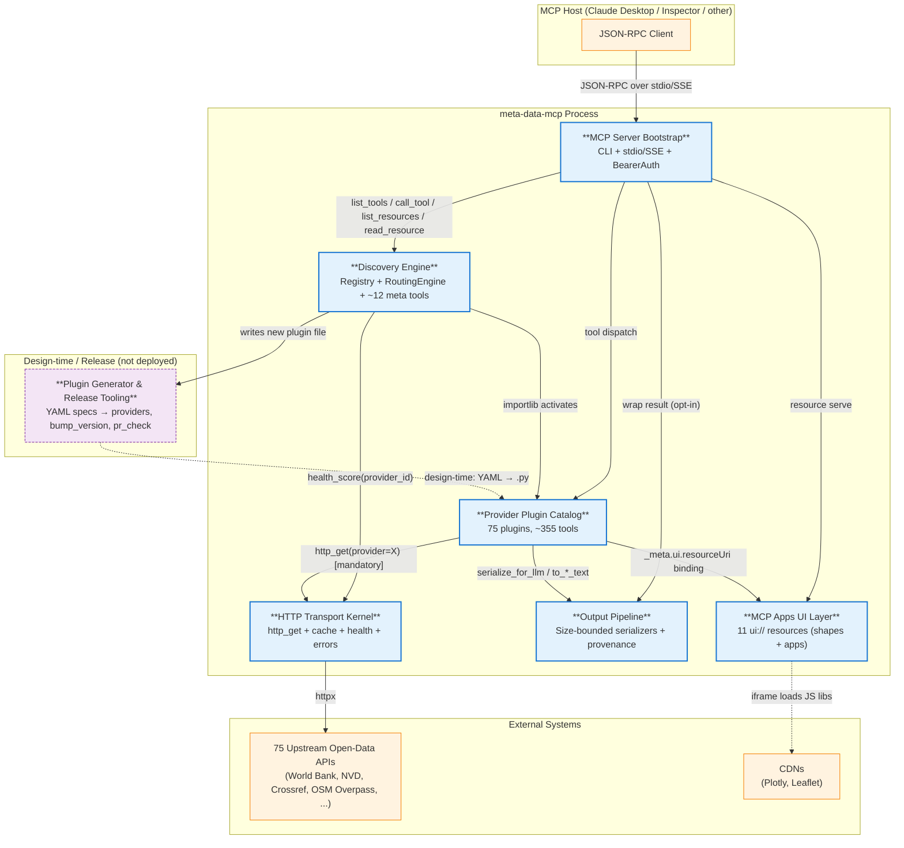

# C4-Component: meta-data-mcp — Master Index

This is the C4 Component-level overview of the meta-data-mcp system. Seven
components live inside the single deployable container (the
`meta-data-mcp` Python process). Each component is documented in detail
in its own file linked below.

## System Components

| Component | Short description | Detail |
|---|---|---|
| **MCP Server Bootstrap** | Process entrypoint, CLI, dual transport (stdio + SSE), bearer auth, CORS. Wires the SDK's six low-level handlers to the shared TOOLS/RESOURCES catalog. | [c4-component-mcp-server.md](./c4-component-mcp-server.md) |
| **Discovery Engine** | Static + dynamic Registry (75 seed providers) and five-scorer RoutingEngine (weights 0.30/0.20/0.25/0.25/0.05) exposed via ~12 "meta" MCP tools — find / list / describe / activate / deactivate / health-snapshot. | [c4-component-discovery-engine.md](./c4-component-discovery-engine.md) |
| **Provider Plugin Catalog** | 75 lazy-activated provider modules exposing ~355 MCP tools across upstream open-data APIs, all conforming to one declarative contract (PROVIDER_ID + TOOLS + TOOLS_HANDLERS). | [c4-component-provider-plugins.md](./c4-component-provider-plugins.md) |
| **HTTP Transport Kernel** | Mandatory `http_get(provider=)` / `http_post(provider=)` chokepoint with TTL cache, exponential-decay HealthScorer, and typed ProviderError hierarchy. The only place `httpx` is imported. | [c4-component-transport-kernel.md](./c4-component-transport-kernel.md) |
| **Output Pipeline** | Size-bounded JSON serializers for the four canonical shapes (records / timeseries / geofeatures / entity-graph) plus opt-in sha256+timestamp provenance metadata bound to (tool, args, content). | [c4-component-output-pipeline.md](./c4-component-output-pipeline.md) |
| **MCP Apps UI Layer** | 11 `ui://meta-data-mcp/...` resources (3 shape primitives, 8 interactive apps) rendered in sandboxed iframes via the MCP Apps protocol extension; postMessage round-trip for tool invocation. | [c4-component-mcp-apps.md](./c4-component-mcp-apps.md) |
| **Plugin Generator & Release Tooling** | Design-time-only — 17 YAML provider specs in `tools/specs/` scaffold provider modules via `generate_provider.py`; `bump_version.py` + `pr_check.sh` + systemd installer round out the release plumbing. **Not deployed.** | [c4-component-tooling.md](./c4-component-tooling.md) |

## Component Relationships

## Layer Summary

- **Edge** — MCP Server Bootstrap (transport + middleware)
- **Control plane** — Discovery Engine (which providers exist, which to use, when to turn them on)
- **Data plane** — Provider Plugin Catalog (the actual upstream fetches)
- **Kernel** — HTTP Transport Kernel + Output Pipeline (every plugin uses both; HTTP is mandatory, serialization is recommended, provenance is opt-in)
- **Presentation** — MCP Apps UI Layer (iframes that render shapes or run apps)
- **Off-process** — Plugin Generator & Release Tooling (design time only)

## Cross-References

- [c4-container.md](./c4-container.md) — deployment view (one container, two transport modes)
- [c4-context.md](./c4-context.md) — system context, personas, user journeys
- API surface — [apis/meta-data-mcp-api.md](./apis/meta-data-mcp-api.md) (JSON-RPC method catalog)
