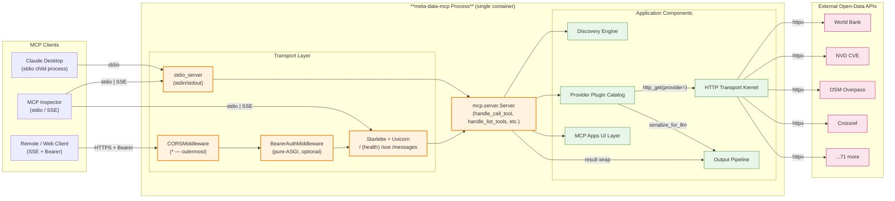

# C4-Container: meta-data-mcp

The system deploys as **one container** — a single Python process named
`meta-data-mcp`. There is no separate web server, database, or queue;
the process owns the full server-side logic. State is in-process and
non-persistent (ADR-0001).

The container exposes its functionality over **two transport modes**.
Both speak MCP's JSON-RPC 2.0 wire protocol; they differ only in how
bytes move on the wire.

## Containers

### `meta-data-mcp` (main and only)

| Attribute | Value |
|---|---|
| **Name** | `meta-data-mcp` |
| **Description** | Single-process MCP server that aggregates 75 open-data APIs into one discoverable catalog with lazy plugin activation. |
| **Type** | Python process (CLI binary `meta-data-mcp`, installed via `uv` / `pip`). |
| **Technology** | Python 3.12+ • MCP SDK (low-level `mcp.server.Server`) • `httpx` for outbound HTTP • Starlette + Uvicorn (SSE) • `mcp.server.stdio` (stdio) • Pydantic v2 • Click (CLI) |
| **Deployment** | Local: `uv run meta-data-mcp run` (defaults to SSE on 127.0.0.1:8000) or `uv run meta-data-mcp run --transport stdio`. Production: systemd unit via `scripts/install-systemd-service.sh`. |

#### Purpose

The container's job: receive an MCP client connection, present a small
default tool catalog (~11 meta tools), and let the client discover,
activate, and call data tools across 75 upstream open-data APIs — all
through one connection, with uniform error translation, response
size-bounding, and optional tamper-evident provenance.

Lazy activation is the load-bearing design choice. A fresh server boots
with only the meta tools loaded, so `tools/list` returns a manageable
catalog. Plugins import on demand (via `opendata-activate-provider` or
via the `META_DATA_MCP_PRELOAD` env var at boot).

#### Components in this Container

All seven application components live in this single process. See
[c4-component.md](./c4-component.md) for the full inventory:

- **MCP Server Bootstrap** — `meta_data_mcp.server` + `meta_data_mcp.cli`
- **Discovery Engine** — `meta_data_mcp.discovery.*` + `meta_data_mcp.registry` + `meta_data_mcp.routing` + `meta_data_mcp.providers.meta_data_mcp`
- **Provider Plugin Catalog** — `meta_data_mcp.providers.*` (75 modules, lazy imported)
- **HTTP Transport Kernel** — `meta_data_mcp.transport` + `meta_data_mcp.errors` + `meta_data_mcp.health` + `meta_data_mcp.provider_config`
- **Output Pipeline** — `meta_data_mcp.serialize` + `meta_data_mcp.fields` + `meta_data_mcp.provenance`
- **MCP Apps UI Layer** — `meta_data_mcp.ui_resources.*` (11 modules)
- **Plugin Generator & Release Tooling** — `tools/` + `scripts/` — **not in the runtime container** (design time only)

#### Interfaces (Container APIs)

The container exposes one logical API — **MCP over JSON-RPC 2.0** — in
two transport flavors plus a CLI for operators. Full method catalog
in [apis/meta-data-mcp-api.md](./apis/meta-data-mcp-api.md).

**stdio transport** (Claude Desktop, MCP Inspector)
- Protocol: line-delimited JSON-RPC 2.0 on stdin/stdout
- Auth: none (process-local trust boundary)
- Started by: `meta-data-mcp run --transport stdio`
- Method catalog: see API spec below

**SSE transport** (remote / web clients)
- Protocol: JSON-RPC 2.0 inside Server-Sent Events
- Endpoints:
  - `GET /` — JSON health probe (always open)
  - `GET /sse` — SSE event stream (auth-protected when `META_DATA_MCP_AUTH_TOKEN` is set)
  - `POST /messages` — Client-to-server callbacks (auth-protected)
- Auth: optional `Authorization: Bearer <token>` via `BearerAuthMiddleware` (pure ASGI to avoid buffering SSE)
- CORS: open (`*`), wrapped *outside* the bearer middleware so OPTIONS preflights aren't blocked
- Started by: `meta-data-mcp run` (default) or `meta-data-mcp run --transport sse --host 0.0.0.0 --port 3001`

**CLI** (operator / setup)
- `setup` — write a Claude Desktop config block
- `remove` / `cleanup` — undo `setup`
- `inspect` — open MCP Inspector against the running server
- `list` / `info` — local provider catalog browse
- `version` — print version
- `run` — main server entrypoint

#### API Specifications

The MCP protocol is JSON-RPC 2.0, not REST — OpenAPI is the wrong tool
for documenting it. Instead, see the method catalog at
[apis/meta-data-mcp-api.md](./apis/meta-data-mcp-api.md), which lists
every JSON-RPC method the server handles plus the dynamic
`tools/call` and `resources/read` namespaces (~11 meta tools, ~355
plugin tools when fully activated, 11 UI resources).

#### Dependencies

**No internal container dependencies** — this is a single-container
deployment.

**External systems** (the data being aggregated):

| External system | Type | Protocol | Direction |
|---|---|---|---|
| ~75 upstream open-data APIs | HTTP APIs (REST / SDMX / CKAN / Socrata / Overpass-QL / GraphQL / etc.) | HTTPS | Outbound from `http_get`/`http_post` |
| CDN-hosted JS libraries (Plotly, Leaflet) | Static assets | HTTPS | Loaded by client iframes, not by the container itself |
| MCP host (Claude Desktop, Inspector, custom clients) | MCP protocol consumer | JSON-RPC over stdio or SSE | Inbound |

The container itself does not require any database, queue, or cache
backend. The TTL cache and HealthScorer state live in-process; restart
loses both (ADR-0001 documents the no-persistence decision and revisit
triggers).

#### Infrastructure

| Aspect | Value |
|---|---|
| **Process model** | Single Python process. No fork/exec, no worker pool. |
| **Resource footprint** | Cold-start ~50 MB RSS (~11 meta tools loaded). Each activated provider adds 1-5 MB depending on Pydantic schema complexity. Cache bounded to 256 entries. |
| **Storage** | None at runtime. ADR-0001: no persistent state in v2.x. |
| **Scaling** | Vertical only. Each connecting client gets its own process when stdio'd; SSE multiplexes one process across N connections. |
| **Logging** | stdlib `logging` to stderr; structured by logger name (`meta_data_mcp.*`). |
| **Deployment artifacts**: | `pyproject.toml`, `uv.lock`, `scripts/install-systemd-service.sh` (for production), `.github/workflows/release.yml` (PyPI publish on tag push) |

#### Container Diagram

## Related Documentation

- [c4-context.md](./c4-context.md) — system context, personas, user journeys
- [c4-component.md](./c4-component.md) — component-level overview
- [apis/meta-data-mcp-api.md](./apis/meta-data-mcp-api.md) — JSON-RPC method catalog
- [docs/adrs/0001-no-persistence-v2.md](../docs/adrs/0001-no-persistence-v2.md) — the no-persistence decision
- [docs/ROADMAP.md](../docs/ROADMAP.md) — future container/HA work (out of scope for v2.x)
