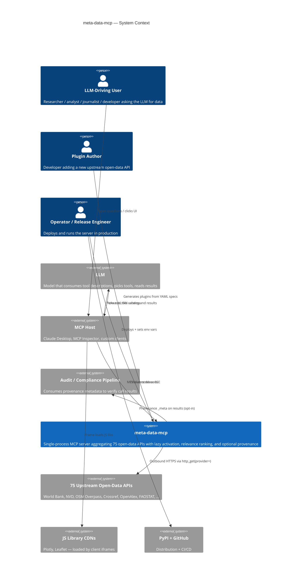

# C4-Context: meta-data-mcp

## System Overview

**Short description.** meta-data-mcp is a single Model Context Protocol
(MCP) server that aggregates ~75 open-data APIs — government data
portals, scholarly indexes, vulnerability feeds, weather, finance,
geospatial — into one discoverable, lazily-activated catalog for LLMs
and the humans driving them.

**Long description.** Open-data APIs are powerful but fragmented. Each
upstream has its own schema, auth posture, rate-limit etiquette, and
response shape. An LLM that wants to "ask any of them anything" would
either need 75 separate MCP servers configured (tool catalog explosion,
context-budget collapse) or one giant aggregator that loads everything
at boot (same problem). meta-data-mcp resolves the tension with three
moves:

1. **Lazy activation.** The server boots advertising only ~11 "meta"
   tools — discovery and activation primitives. Data plugins import
   on demand when the user (or `META_DATA_MCP_PRELOAD`) asks for them.
2. **A relevance-ranked discovery engine.** `opendata-find-providers`
   takes a free-text query, runs it through a five-scorer engine
   (token / fuzzy / metadata / semantic / health), and returns ranked
   providers with explainable score breakdowns.
3. **A presentation layer.** Tools return canonical payload shapes
   (records / timeseries / geofeatures / custom) that bind to
   `ui://` resources via the MCP Apps protocol extension —
   visualizations render inside sandboxed iframes alongside the JSON
   the LLM consumes.

The result: one MCP server, one connection, one small default catalog,
75 upstream data sources reachable in two tool calls (find → activate),
and visualizations for free when the host supports MCP Apps.

## Personas

### Human users

#### LLM-Driving User
- **Type**: Human (via an MCP host)
- **Description**: The person at the keyboard. Could be a researcher hunting for vulnerability data, an analyst pulling World Bank indicators, a journalist tracing trade flows, an OSINT investigator querying ASN topology, or a developer prototyping against open data.
- **Goals**: Get data fast, without learning 75 different APIs. Reach into specialized sources without leaving the chat. See the data visualized when it helps.
- **Key features used**: `opendata-find-providers` (discovery), `opendata-activate-provider` (turn-on), individual provider tools (the actual data fetch), MCP Apps UI panels (rendering).

#### Plugin Author
- **Type**: Human (developer)
- **Description**: Someone adding a new open-data source. Usually writes a 30-line YAML spec under `tools/specs/` and runs the generator; sometimes hand-writes a more complex plugin.
- **Goals**: Add a provider with minimal boilerplate, conform to the kernel contract (mandatory `http_get`, size-bounded serializers), get a test stub for free, ship a PR.
- **Key features used**: `tools/generate_provider.py`, `tools/specs/*.yaml`, the size-bounded serializers, the kernel's `http_get` and error translation, the `ui_resources` aggregator for binding shape primitives.

#### Operator / Release Engineer
- **Type**: Human
- **Description**: The person who deploys, ops, and releases the server.
- **Goals**: Boot the server, set the bearer token, see operational logs, handle releases.
- **Key features used**: `meta-data-mcp run --transport sse`, `META_DATA_MCP_AUTH_TOKEN`, `META_DATA_MCP_PRELOAD`, `META_DATA_MCP_PROVENANCE` (audit), `scripts/install-systemd-service.sh`, `scripts/bump_version.py`, `make pr-check`.

### Programmatic "users"

#### LLM (model)
- **Type**: Programmatic
- **Description**: The actual consumer of `tools/list` and `tools/call` responses. Reads tool descriptions, picks tools, fills argument schemas, reads JSON results.
- **Goals**: Find the right tool for the user's question, call it with correctly-shaped arguments, present results.
- **Key features used**: Every tool's `description` + `inputSchema`, the relevance-ranked discovery output, the size-bounded TextContent responses.

#### MCP Host
- **Type**: Programmatic
- **Description**: Claude Desktop, MCP Inspector, or any other MCP client. Handles the JSON-RPC connection, renders the UI, sandboxes the iframe, and proxies `tool_call` postMessage events from apps back to the server.
- **Goals**: Mount UI resources with the correct MIME, render them next to the result, route iframe-initiated `tool_call` events back through the wire.

#### Audit / Compliance Consumer
- **Type**: Programmatic (downstream system)
- **Description**: When `META_DATA_MCP_PROVENANCE=1`, every tool result carries `_meta["meta-data-mcp/provenance"] = {sha256, timestamp}` covering the canonical `(tool, arguments, content)` envelope. An audit log / SIEM / compliance pipeline can ingest these to prove what was returned for what call.
- **Goals**: Tamper-evident audit trail. Distinguish "tool A returned X" from "tool B returned X". Recompute the digest from visible content using the documented receiver recipe.

## System Features

| Feature | Description | Users |
|---|---|---|
| **Provider discovery** | Free-text query → ranked list of relevant providers with score breakdowns. | LLM, LLM-Driving User |
| **Lazy plugin activation** | Turn on a provider on demand; activation mutates the live `tools/list` and emits `tools/list_changed`. | LLM, LLM-Driving User |
| **Open-data tool catalog** | ~355 tools across 75 providers spanning 25+ domains (government data, finance, vulnerabilities, scholarly, geo, weather, etc.). | LLM, LLM-Driving User |
| **Size-bounded responses** | Binary-search prefix trim per canonical shape keeps responses inside `MAX_RESPONSE_CHARS`. | LLM |
| **Health-aware ranking** | Upstream failures decay provider health (τ=300s); RoutingEngine deprioritizes unhealthy providers (weight 0.05). | LLM, LLM-Driving User |
| **MCP Apps presentation** | 11 `ui://` resources (3 shape primitives + 8 interactive apps) render visualizations in sandboxed iframes. | LLM-Driving User, MCP Host |
| **Optional provenance** | sha256+timestamp on every result, opt-in via env var. | Audit / Compliance Consumer |
| **Dynamic plugin generation** | `opendata-draft-spec` + `opendata-create-plugin` let the LLM/user scaffold a new provider at runtime. | LLM-Driving User, Plugin Author |
| **Bearer-auth SSE** | When `META_DATA_MCP_AUTH_TOKEN` is set, SSE endpoints require `Authorization: Bearer <token>`. | Operator |

## User Journeys

### Journey 1: Find-and-Use (LLM-Driving User)

The most common flow. The user asks a question, the LLM hunts.

1. **Connect** — User launches Claude Desktop / Inspector. Host spawns `meta-data-mcp` over stdio.
2. **List tools** — Host issues `tools/list`. Server returns ~11 meta tools.
3. **Ask** — User types "what was global wheat production in 2020?"
4. **Discover** — LLM calls `opendata-find-providers(query="global wheat production 2020")`. Discovery Engine runs the five-scorer pipeline, returns ranked `[ScoredProvider]` with breakdowns. Top match: `global_faostat`.
5. **Activate** — LLM calls `opendata-activate-provider(provider_id="global_faostat")`. Loader imports the module, merges its TOOLS into the live catalog, emits `tools/list_changed`.
6. **Refresh** — Host re-fetches `tools/list`; now FAOSTAT tools are visible.
7. **Call** — LLM calls the FAOSTAT timeseries tool with `{indicator: "wheat-production", year: 2020}`. Handler calls `http_get(url, provider="global_faostat")` (kernel-mediated). On 2xx the kernel caches and `record_success`; on 5xx it `record_failure` (decaying the provider's score for the next ~5 min); on 401/403 it does *not* penalize.
8. **Render** — Result is `[TextContent]` shaped as the timeseries contract, with `_meta.ui.resourceUri = "ui://meta-data-mcp/shape/timeseries/v1"`. If `META_DATA_MCP_PROVENANCE=1`, first block carries `_meta["meta-data-mcp/provenance"]`.
9. **Display** — Host fetches the UI resource via `resources/read`, mounts the Plotly bundle in a sandboxed iframe alongside the JSON payload, and the user sees the line chart.

### Journey 2: Tool Authoring (Plugin Author)

1. **Find a target** — Author identifies an open-data API not yet covered.
2. **Write a spec** — Author creates `tools/specs/<name>.yaml` with id, server_name, description, base_url, tools[], and optional `response_shape: records|timeseries|geofeatures|custom`.
3. **Generate** — Author runs `uv run python tools/generate_provider.py tools/specs/<name>.yaml`. Generator writes `meta_data_mcp/providers/<name>.py` + `tests/providers/test_<name>.py` (refuses to overwrite without `--force`).
4. **Register in static catalog** — Author appends a `ProviderEntry` to the seed list in `registry.py` so the discovery engine can find it.
5. **Hand-tune** — If the upstream needs custom logic (auth headers, pagination, response massaging), author edits the generated module.
6. **Test** — `uv run pytest tests/providers/test_<name>.py` against the kernel-mocked HTTP layer.
7. **PR** — `make pr-check N=<pr-number>` enforces the seven-step merge gate.

### Journey 3: Programmatic Audit (Compliance Consumer)

1. **Server starts** with `META_DATA_MCP_PROVENANCE=1` set.
2. Every successful `call_tool` produces a `[TextContent]` whose first block carries `_meta["meta-data-mcp/provenance"] = {sha256, timestamp}`.
3. Audit pipeline ingests the response.
4. To verify, audit pipeline strips `_meta` from each content block, builds the envelope `{tool, arguments, content}`, JSON-dumps with `mode="json", by_alias=True, exclude_none=True, sort_keys=True, separators=(",",":"), ensure_ascii=True` per the receiver recipe in `meta_data_mcp/provenance.py`, and sha256-hashes the bytes.
5. Recomputed digest matches advertised → tamper-evident pass.
6. Two different `(tool, arguments)` pairs that returned identical content produce different fingerprints — the binding lets the audit pipeline distinguish them.

### Journey 4: Remote Hosting (Operator)

1. **Install** — Operator runs `scripts/install-systemd-service.sh`, which creates a service user, writes a bearer token, drops a systemd unit.
2. **Boot** — systemd starts `meta-data-mcp run --transport sse --host 0.0.0.0 --port 8000` with `META_DATA_MCP_AUTH_TOKEN=<token>` and optionally `META_DATA_MCP_PRELOAD=us_data_gov,global_world_bank`.
3. **Connect** — Remote MCP client opens `GET /sse` with `Authorization: Bearer <token>`. `BearerAuthMiddleware` checks via `hmac.compare_digest`. CORS sits *outside* the auth check so OPTIONS preflights pass.
4. **Run** — Same MCP semantics as stdio; the only difference is the wire.

## External Systems and Dependencies

| System | Type | Integration | Purpose |
|---|---|---|---|
| **75 upstream open-data APIs** | HTTP APIs (REST / SDMX / CKAN / Socrata / Overpass-QL / GraphQL / etc.) | Outbound HTTPS via `http_get`/`http_post`, kernel-mediated | The data being aggregated |
| **MCP host** (Claude Desktop / Inspector / other) | MCP protocol consumer | Inbound JSON-RPC over stdio or SSE | The client that drives the server |
| **Plotly + Leaflet CDNs** | Static asset hosts | Loaded by browser inside sandboxed iframes (not by the server) | UI bundles for shape primitives |
| **PyPI** | Package registry | Outbound at release time only | Publish target via `release.yml` workflow |
| **GitHub** | SCM + CI | Outbound at release / development time | Code hosting, Actions for CI + release, `gh` CLI integration in `pr_check.sh` |
| **systemd** (production deployments) | OS service manager | Outbound `systemctl` from `install-systemd-service.sh` | Production deployment target |

## System Context Diagram

## Related Documentation

- [c4-container.md](./c4-container.md) — single-container deployment view
- [c4-component.md](./c4-component.md) — seven-component master index
- [c4-code-*.md](./) — code-level documentation per architectural unit
- [apis/meta-data-mcp-api.md](./apis/meta-data-mcp-api.md) — JSON-RPC method catalog
- Repo: [README.md](../README.md) — user-facing setup, env vars, transports
- Architecture: [docs/meta-data-mcp-architecture.md](../docs/meta-data-mcp-architecture.md)
- Roadmap: [docs/ROADMAP.md](../docs/ROADMAP.md)
- Decisions: [docs/adrs/0001-no-persistence-v2.md](../docs/adrs/0001-no-persistence-v2.md)
